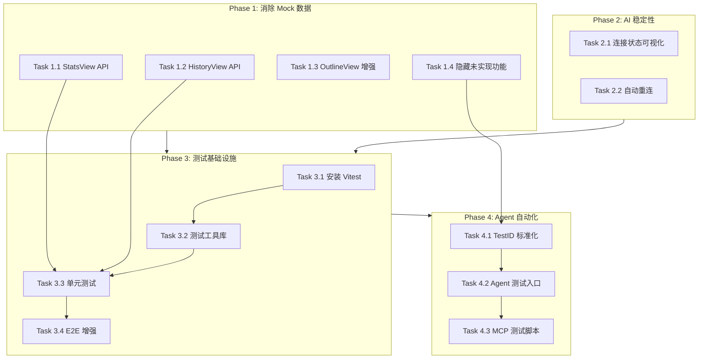

# Sprint: Frontend Completion

将 WriteNow 前端从"UI 骨架"提升为"完整可用产品"。

---

## 一、当前状态诊断

### 1.1 后端 API 状态

后端 5 个核心服务均已 **Production-ready**（无 stub、无 TODO）：

| 服务 | IPC Channels | 状态 |

|------|-------------|------|

| stats-service | `stats:getToday`, `stats:getRange`, `stats:increment` | 完整 |

| version-service | `version:list/create/restore/diff` | 完整 |

| skills-service | JSON-RPC `listSkills/getSkill` | 完整 |

| files-service | `file:list/read/write/create/delete` | 完整 |

| snapshot-service | `file:snapshot:latest/write` | 完整 |

### 1.2 前端组件 API 集成状态

| 组件 | 当前状态 | 应使用的 API | 复杂度 |

|------|---------|-------------|-------|

| `FilesView` | API 已接入 | `file:list/create/delete` | N/A |

| `VersionHistoryPanel` | API 已接入 | `version:list/create/restore/diff` | N/A |

| `AIPanel` | API 已接入 | `ai:skill:run/cancel`, `skill:list` | N/A |

| `EditorPanel` | API 已接入 | `file:read/write/snapshot:write` | N/A |

| **HistoryView** | Mock 数据 | `version:list` | Medium |

| **StatsView** | Mock 数据 | `stats:getToday/getRange` | Low |

| **OutlineView** | 前端解析 | `outline:get` 或保持纯前端 | Medium |

| **SettingsView** | Mock 数据 | 多个设置 API | Medium-High |

| **WorkflowView** | Mock 数据 | 需要设计元数据系统 | High |

| **MaterialsView** | Mock 数据 | 后端不存在 | High |

| **PublishView** | Mock 数据 | 后端不存在 | High |

### 1.3 测试基础设施状态

| 类型 | 状态 | 详情 |

|------|------|------|

| E2E 测试 | 已存在 | 34 个 Playwright 测试文件 |

| 单元测试 | 缺失 | Vitest 配置存在但未安装 |

| 组件测试 | 缺失 | 无 Testing Library |

| 测试工具 | 缺失 | 无共享 helper |

---

## 二、架构决策

### 2.1 功能重复处理

- `HistoryView`（侧边栏）与 `VersionHistoryPanel`（FlexLayout 面板）功能重复
- **决策**：`HistoryView` 复用 `VersionHistoryPanel` 的逻辑，作为轻量级入口

### 2.2 不完整功能处理

- `MaterialsView`、`PublishView`、`WorkflowView` 后端 API 不存在
- **决策**：
                                                                                                                                - Phase 1：隐藏或标记"即将推出"
                                                                                                                                - Phase 2+：设计并实现后端 API

### 2.3 测试策略

```
┌─────────────────────────────────────────────────────────┐
│                    E2E Tests (Playwright)               │
│              完整用户流程 · 真实后端 · Electron          │
├─────────────────────────────────────────────────────────┤
│              Integration Tests (Vitest + MSW)           │
│          API 调用 · Mock 后端 · 关键路径覆盖             │
├─────────────────────────────────────────────────────────┤
│           Unit Tests (Vitest + Testing Library)         │
│           纯函数 · 组件渲染 · Hooks 逻辑                 │
└─────────────────────────────────────────────────────────┘
```

---

## 三、实施计划

### Phase 1: 消除 Mock 数据（高优先级）

#### Task 1.1: StatsView 接入真实 API

**文件**: [`writenow-frontend/src/features/sidebar/StatsView.tsx`](writenow-frontend/src/features/sidebar/StatsView.tsx)

**当前**：硬编码 `weeklyData`、`1,234 字`、`45,234 总字数`

**改动**：

```typescript
// 新增 hooks
const [todayStats, setTodayStats] = useState<WritingStatsRow | null>(null);
const [rangeStats, setRangeStats] = useState<StatsGetRangeResponse | null>(null);

// 调用 API
useEffect(() => {
  invoke('stats:getToday', {}).then(res => setTodayStats(res.stats));
  const today = new Date();
  const weekAgo = new Date(today.getTime() - 7 * 24 * 60 * 60 * 1000);
  invoke('stats:getRange', {
    startDate: weekAgo.toISOString().split('T')[0],
    endDate: today.toISOString().split('T')[0],
  }).then(res => setRangeStats(res));
}, []);
```

**验收标准**：

- 今日字数、阅读时长显示真实数据
- 本周柱状图显示真实数据
- 总计数据显示累计值

---

#### Task 1.2: HistoryView 接入真实 API

**文件**: [`writenow-frontend/src/features/sidebar/HistoryView.tsx`](writenow-frontend/src/features/sidebar/HistoryView.tsx)

**当前**：硬编码 `mockVersions`

**改动**：

- 复用 [`VersionHistoryPanel.tsx`](writenow-frontend/src/features/version-history/VersionHistoryPanel.tsx) 的 `version:list` 调用逻辑
- 将 `selectedFile` prop 映射为 `articleId`
- 添加加载/错误状态

**验收标准**：

- 选中文件后显示真实版本历史
- 预览/恢复按钮可用
- 无文件时显示提示

---

#### Task 1.3: OutlineView 增强

**文件**: [`writenow-frontend/src/features/sidebar/OutlineView.tsx`](writenow-frontend/src/features/sidebar/OutlineView.tsx)

**当前**：仅前端解析 Markdown 标题

**改动**：

- 保持纯前端解析（性能好、实时）
- 添加点击标题跳转到对应位置功能（需要 editor ref）
- 改用 `editor.commands.focus(pos)` 实现跳转

**验收标准**：

- 点击大纲标题跳转到编辑器对应位置
- 编辑时大纲实时更新

---

#### Task 1.4: 不完整功能处理

**文件**: [`writenow-frontend/src/components/layout/ActivityBar.tsx`](writenow-frontend/src/components/layout/ActivityBar.tsx)

**决策**：暂时隐藏未实现功能

**改动**：

```typescript
const activities = [
  { id: 'files', ... },
  { id: 'outline', ... },
  { id: 'history', ... },
  // { id: 'workflow', ... },   // 隐藏
  // { id: 'materials', ... },  // 隐藏
  // { id: 'publish', ... },    // 隐藏
  { id: 'stats', ... },
  { id: 'settings', ... },
];
```

**验收标准**：

- ActivityBar 只显示已实现的功能
- 无 Mock 数据出现在 UI 中

---

### Phase 2: AI 面板稳定性

#### Task 2.1: 连接状态可视化

**文件**: [`writenow-frontend/src/features/ai-panel/AIPanel.tsx`](writenow-frontend/src/features/ai-panel/AIPanel.tsx)

**当前问题**：

- 连接状态不可见（用户不知道后端是否可用）
- 无自动重连

**改动**：

- 在面板顶部显示连接状态指示器
- 添加手动重连按钮
- 连接失败时显示明确提示
```typescript
// 在 AIPanel 顶部添加
{aiStatus !== 'connected' && (
  <div className="px-3 py-2 bg-yellow-900/20 text-yellow-400 text-xs flex items-center gap-2">
    <span>后端未连接</span>
    <Button size="xs" onClick={() => aiClient.connect()}>重连</Button>
  </div>
)}
```


---

#### Task 2.2: 自动重连机制

**文件**: [`writenow-frontend/src/lib/rpc/jsonrpc-client.ts`](writenow-frontend/src/lib/rpc/jsonrpc-client.ts)

**改动**：

- 添加 `autoReconnect` 选项
- 实现指数退避重连
- 连接恢复时自动重新加载 skills

---

### Phase 3: 测试基础设施

#### Task 3.1: 安装 Vitest

**文件**: [`writenow-frontend/package.json`](writenow-frontend/package.json)

```bash
cd writenow-frontend
npm install -D vitest @vitest/ui @vitest/coverage-v8
npm install -D @testing-library/react @testing-library/jest-dom jsdom
```

**创建配置**: `writenow-frontend/vitest.config.ts`

```typescript
import { defineConfig } from 'vitest/config';
import react from '@vitejs/plugin-react';
import path from 'path';

export default defineConfig({
  plugins: [react()],
  test: {
    environment: 'jsdom',
    globals: true,
    setupFiles: ['./tests/setup.ts'],
    include: ['src/**/*.test.{ts,tsx}'],
    coverage: {
      provider: 'v8',
      reporter: ['text', 'html'],
    },
  },
  resolve: {
    alias: {
      '@': path.resolve(__dirname, './src'),
    },
  },
});
```

---

#### Task 3.2: 创建测试工具库

**创建**: `writenow-frontend/tests/utils/`

```typescript
// tests/utils/test-helpers.ts
export function createMockRpcClient() { ... }
export function renderWithProviders(component: ReactNode) { ... }

// tests/utils/mock-data.ts
export const mockVersions: VersionListItem[] = [...];
export const mockStats: WritingStatsRow = {...};

// tests/utils/e2e-helpers.ts
export async function launchApp(...) { ... }  // 从现有测试提取
```

---

#### Task 3.3: 单元测试覆盖

**目标文件**（按优先级）：

| 文件 | 测试类型 | 优先级 |

|------|---------|-------|

| `lib/rpc/api.ts` | 函数测试 | P0 |

| `lib/editor/text-stats.ts` | 函数测试 | P0 |

| `lib/diff/diffUtils.ts` | 函数测试 | P0 |

| `stores/*.ts` | Store 测试 | P1 |

| `features/sidebar/StatsView.tsx` | 组件测试 | P1 |

| `features/sidebar/HistoryView.tsx` | 组件测试 | P1 |

---

#### Task 3.4: E2E 测试增强

**创建**: `writenow-frontend/tests/e2e/sidebar-views.spec.ts`

```typescript
test('StatsView: displays real statistics from backend', async () => {
  // 1. 创建文件并输入内容
  // 2. 切换到统计视图
  // 3. 验证字数统计非零
  // 4. 验证本周图表有数据
});

test('HistoryView: shows version history for selected file', async () => {
  // 1. 创建文件
  // 2. 编辑并保存多次
  // 3. 切换到版本历史视图
  // 4. 验证版本列表非空
  // 5. 点击预览按钮
  // 6. 验证预览内容显示
});
```

---

### Phase 4: Agent 自动化测试能力

#### Task 4.1: 测试 ID 标准化

**改动**：为所有可交互元素添加 `data-testid`

```typescript
// ActivityBar.tsx
<button data-testid={`activity-${activity.id}`} ...>

// StatsView.tsx
<div data-testid="stats-today-wordcount">{todayStats?.wordCount}</div>
<div data-testid="stats-weekly-chart">...</div>
```

---

#### Task 4.2: 创建 Agent 测试入口

**创建**: `writenow-frontend/tests/e2e/agent-test-runner.spec.ts`

设计一个可被 Agent 驱动的测试框架：

```typescript
/**
 * Agent 可调用的测试场景
 * 通过 browser MCP 驱动执行
 */
export const testScenarios = {
  // 核心流程
  'create-file-edit-save': async (page) => { ... },
  'version-history-restore': async (page) => { ... },
  'stats-display-accuracy': async (page) => { ... },
  
  // 边界测试
  'long-content-10k-chars': async (page) => { ... },
  'special-characters-unicode': async (page) => { ... },
  'rapid-consecutive-saves': async (page) => { ... },
  'network-disconnect-recovery': async (page) => { ... },
};
```

---

#### Task 4.3: 浏览器 MCP 测试脚本

**创建**: `writenow-frontend/tests/mcp/browser-tests.md`

Agent 可读取并执行的测试剧本：

```markdown
## Test: StatsView Real Data

1. browser_navigate to http://localhost:5180
2. browser_click on [data-testid="activity-stats"]
3. browser_snapshot and verify:
   - Element [data-testid="stats-today-wordcount"] exists
   - Content is not "1,234" (mock data)
4. If content is "0", create a file and type some text
5. Verify stats update
```

---

## 四、验收标准（Definition of Done）

### 功能验收

- [x] 所有显示在 UI 中的功能都使用真实 API 数据 ✅ PR #237
- [x] 无 Mock 数据出现在生产代码中 ✅ PR #237
- [x] 未实现的功能已隐藏或标记"即将推出" ✅ PR #237
- [x] AI 面板连接状态可见且可恢复 ✅ PR #239

### 测试验收

- [x] Vitest 已安装且配置正确 ✅ PR #241
- [x] 核心工具函数有单元测试（15 tests passing）✅ PR #241
- [ ] 每个已接入 API 的侧边栏视图有 E2E 测试
- [x] 所有测试在 CI 中通过 ✅ PR #241

### Agent 测试验收

- [x] 关键可交互元素有 `data-testid` ✅ PR #237, #243
- [x] Agent 可通过 browser MCP 执行完整测试流程 ✅ PR #243
- [x] 测试脚本覆盖边界情况 ✅ PR #243

### 完成记录

| Phase | Issue | PR | 合并时间 |

|-------|-------|-----|---------|

| Phase 1: 消除 Mock 数据 | #236 | #237 | 2026-01-26 |

| Phase 2: AI 面板稳定性 | #238 | #239 | 2026-01-26 |

| Phase 3: 测试基础设施 | #240 | #241 | 2026-01-26 |

| Phase 4: Agent 自动化 | #242 | #243 | 2026-01-26 |

---

## 五、任务依赖关系



---

## 六、风险与缓解

| 风险 | 影响 | 缓解措施 |

|------|------|---------|

| 后端 API 与前端预期不一致 | 集成失败 | 先写 API 调用测试验证合约 |

| E2E 测试不稳定 | CI 卡住 | 添加重试机制、增加超时 |

| Agent 测试无法覆盖所有边界 | 漏测 | 结合手动探索性测试 |

| 隐藏功能影响用户预期 | 用户抱怨 | 添加"即将推出"提示 |

---

## 七、时间估算

| Phase | 任务数 | 估算 |

|-------|-------|------|

| Phase 1: 消除 Mock | 4 | 1-2 天 |

| Phase 2: AI 稳定 | 2 | 0.5-1 天 |

| Phase 3: 测试基础 | 4 | 2-3 天 |

| Phase 4: Agent 自动化 | 3 | 1-2 天 |

| **总计** | **13** | **5-8 天** |