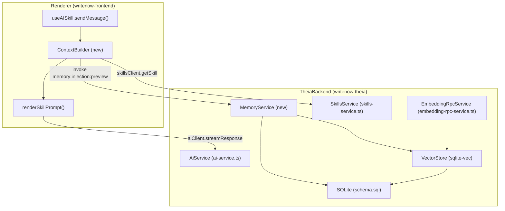

# 借鉴 MemOS/Mem0 设计理念的轻量级记忆系统（本地优先）

## 与 OpenSpec 的关系（本计划为补充，不替代）

- 权威规范（SSOT）：`openspec/specs/sprint-ai-memory/spec.md`（以及其 `design/` 与 `task_cards/`）
- 本计划定位：补齐 Spec 在工程落地层面的“决策空白”（数据模型一步到位、语义召回接入点、stablePrefixHash 口径、交付流程），用于执行与验收
- 冲突处理：若本计划与 Spec 冲突，以 Spec 为准；需要变更必须先更新 Spec/RFC

## 为什么你会觉得“简陋”

- 当前版本更像“方向草案”，缺少 **现状盘点 / 约束与验收 / 风险与降级 / 真实落点文件**，因此不够“可执行”。
- 计划里用了 Markdown 表格与 Mermaid 的 `<br/>`，在部分渲染器里会导致观感差或不渲染。

> 本版计划已：补齐现状盘点与真实落点、给出可执行的阶段拆分与验收，并修复渲染问题（无表格、Mermaid 不用 HTML）。

## 现状盘点（WriteNow 已经具备的“成熟部分”）

- **本地存储（SQLite）已存在**
  - Schema：`writenow-theia/writenow-core/src/node/database/schema.sql` 已有 `user_memory` 表：
    - `id`, `type ('preference'|'feedback'|'style')`, `content`, `project_id (NULL=全局)`, `created_at`, `updated_at`
  - 初始化/迁移：`writenow-theia/writenow-core/src/node/database/init.ts`（`migrateToV3()`..`migrateToV7()`，版本存于 `settings` 表）

- **记忆读写 + 注入选择 + 本地学习已存在**
  - 参考实现：`electron/ipc/memory.cjs`
    - `selectMemoryForInjection()`：确定性排序（type/scope/origin/时间/id），并支持 `injectionEnabled` / `privacyModeEnabled`
    - IPC 形态已在契约中定义：`memory:injection:preview`、`memory:create/update/delete`、`memory:preferences:ingest/clear`
  - 现状缺口：Theia backend 侧尚未实现 memory:* 的 invoke handlers（需要落到 `writenow-theia/writenow-core/src/node/services/` 并通过 `TheiaInvokeRegistry` 注册）

- **向量检索（sqlite-vec）已在项目内落地（无需外部向量 DB）**
  - `writenow-theia/writenow-core/src/node/rag/vector-store.ts`
    - `loadSqliteVec(db)` 加载扩展（并在失败时返回 `DB_ERROR`）
    - `vec0` 表：`articles_vec` / `article_chunks_vec` / `entity_vec`
    - `settings.embedding.dimension` 做维度一致性防护（不一致返回 `CONFLICT`）
  - `writenow-theia/writenow-core/src/node/rag/retrieval.ts`
    - 关键模式：**关键词检索（FTS）永远可用**；语义检索（sqlite-vec）仅在 `embeddingService` 可用时启用（天然支持降级）

- **AI 运行 Meta（hash + injected 回显）已存在**
  - `writenow-theia/writenow-core/src/node/services/ai-service.ts`
    - `prefixHash = fnv1a32Hex(systemPrompt)`、`promptHash = fnv1a32Hex(system+user)`（start 响应返回）
    - `payload.injected.memory` 会被原样回显到 start 响应（用于审计/可观测），但目前 **renderer 未注入任何 memory**

- **Renderer 侧已有最小 prompt 渲染，但尚未做上下文/记忆组装**
  - `writenow-frontend/src/lib/ai/skill-template.ts`：`renderSkillPrompt()` 支持 `{{text}}`、`{{#context}}...{{/context}}`、`{{styleGuide}}`
  - `writenow-frontend/src/features/ai-panel/useAISkill.ts`：当前只传 `text`，未传 `context/styleGuide`，也未接入 `memory:injection:preview`
  - 备注：`context-assembler.ts` / `stable-system-prompt.ts` 在 `writenow-frontend/src/lib/ai/` 目录中目前不存在（需新增/恢复）

## 为什么不“直接引入 MemOS/Mem0（原形态）”

- MemOS/Mem0 的开源形态更偏“服务端记忆服务/平台”，通常假设有独立服务进程与外部组件。
- 约束是：**用户只安装一个 App、无需 Docker/外部服务、记忆默认只在本机**（未来云同步也在我们服务器）。
- 因此策略是：**借鉴设计 + 复用 WriteNow 已有本地基础设施**，而不是把 MemOS/Mem0 当作依赖直接嵌入。

## 从 OpenSpec 继承的目标与硬约束（Spec SSOT）

- **MUST（硬约束）**
  - 不要求用户安装 Docker/Neo4j/Qdrant 等外部服务；不引入常驻后台进程。
  - 记忆默认本地：SQLite + 项目文件（`.writenow/**`）；任何云端能力只预留接口，默认关闭。
  - 遵循 `openspec/specs/sprint-ai-memory/spec.md`：6 层模型、`context_rules` 按需注入、Stable Prefix、确定性序列化、IPC 使用 `IpcResponse<T>` 与稳定错误码。

- **SHOULD（体验目标）**
  - sqlite-vec 或 embedding 不可用时，语义检索可降级但 **技能运行不中断**。
  - 注入内容“少量高价值”，并且用户可查看/删除/关闭（已具备 settings 开关基础）。

## 我们要补齐的“缺口”（相对当前代码）

- **把已经存在的 memory 注入链路接起来**：将 `memory:injection:preview` 的结果注入 renderer prompt（并把注入条目回传给 `AiSkillRunRequest.injected.memory` 用于审计）。
- **落地可验收的 Stable Prefix**：当前 `prefixHash` 是对 systemPrompt 全量 hash，不等于 Layer0-3 的稳定前缀。
- **把 sqlite-vec 扩展到“用户记忆”的语义检索**：现有 vec0 只覆盖文章/段落/实体。
- **Embedding 策略**：默认本地；预留云端 provider 接口（未来接我们服务器），但现在不依赖云服务。

## 从 MemOS / Mem0 借什么（只借能“本地落地”的成熟部分）

- **借 MemOS（Memory OS 思路）**
  - 记忆必须 **可审计/可删除/可纠错**（我们已有 delete + privacy mode，后续补 evidence/metadata）
  - 记忆类型/作用域清晰：global vs project，偏好 vs 事实/事件（由 `type + project_id + metadata` 表达）

- **借 Mem0（工程化提取）**
  - “从交互/反馈中提取可复用条目”的流程：去重、阈值、纠错（我们已有 `memory:preferences:ingest` 雏形）
  - 评估口径：用于我们自研的回归测试与质量门禁

- **坚持 WriteNow 锁定/自研**
  - 6 层模型 + `context_rules` 精准注入
  - Stable Prefix + deterministic serialization + append-only
  - 本地存储（SQLite + 文件）为底座

## 目标架构（无外部服务）



## 关键设计细节（可执行口径）

### 1) 记忆注入：先把“已有能力”用起来

- 在 `writenow-frontend/src/features/ai-panel/useAISkill.ts` 的 `sendMessage()` 中，在调用 `aiClient.streamResponse()` 前：
  - 获取 `projectId`（如果不可用/为 null：视为“无项目上下文”，只允许注入全局记忆）
  - 构造 `queryText`（用于语义召回排序）：优先使用选区文本；若存在额外指令则拼接（并按固定上限截断，保证确定性）
  - 调用 `memory:injection:preview({ projectId, queryText })`（若无 projectId 则不传该字段），拿到 `injected.memory[]`
  - 将 `injected.memory[]` 注入到 system prompt 的 **Layer 2（用户偏好/记忆）** 章节（格式确定性）
  - 将 `injected.memory[]` 作为 `AiSkillRunRequest.injected.memory` 传入后端（用于审计与可观测；`ai-service.ts` 会回显）

### 2) Stable Prefix：把现有 prefixHash 变成可验收的 stablePrefixHash

- **现状**：`writenow-theia/writenow-core/src/node/services/ai-service.ts` 的 `prefixHash` 是对“整个 systemPrompt”hash。
- **目标**：
  - renderer 生成 `stablePrefixText`（Layer0-3，固定章节 + 空占位 + 确定性序列化）。
  - 计算 `stablePrefixHash = fnv1a32Hex(stablePrefixText)` 用于验收 KV-cache 稳定性。
  - `promptHash` 继续保留全量 hash（用于单次诊断/去重）。
- **迁移策略（MUST）**：
  - `AiSkillRunRequest.prompt` 增加 `stablePrefixHash`（由 renderer 计算并传入；backend 不对内容做二次归一化）。
  - `AiSkillRunResponse.prompt` 增加 `stablePrefixHash`（用于验收与诊断）；`prefixHash` 继续保留但不用于 KV-cache 稳定性验收。

### 3) 用户记忆语义检索：复用现有 sqlite-vec + EmbeddingService

- 用户记忆召回采用与 RAG 一致的“可降级但不阻断”原则：
  - baseline：仅基于 DB 的确定性选择（type/scope/origin/updatedAt/id 排序 + 固定预算裁剪）
  - semantic：仅当 `embeddingService` 可用且 `queryText` 非空时启用（否则强制走 baseline）
- 必做实现：
  - `VectorStore` 增加 `user_memory_vec`（`vec0`）与查询方法（等价于 `querySimilarChunks()` 的模式）
  - `MemoryInjectionPreviewRequest` 增加字段 `queryText: string`（允许为空字符串；空字符串等价于禁用语义召回）
    - 当 `queryText` 非空且 embedding 可用：使用 `user_memory_vec` 召回 TopK，随后按确定性规则裁剪到注入预算
    - 否则：强制走 baseline（不阻断技能运行）

### 4) context_rules：按需触发（避免无谓成本与 prompt 漂移）

- `skills.context_rules` 字段已存在于 schema（见 `schema.sql`），并且 theia `skills-service.ts` 已有默认构建函数。
- 计划（不引入新字段，不搞“等价命名”）：
  - `context_rules` 字段集以 `openspec/specs/sprint-ai-memory/design/04-skill-context-injection.md` 为准（`surrounding/user_preferences/style_guide/characters/recent_summary/...`）。
  - **当 `context_rules.user_preferences=true`**：必须调用 `memory:injection:preview` 并把结果注入 Layer 2（用户偏好/记忆）。
  - 注入/裁剪/排序必须确定性（避免 prompt 漂移导致 KV-cache 失效）。

## 数据模型（一步到位，不做“最小侵入”）

- 现有 `user_memory` 结构过于简化（缺少 evidence/confidence/source/version）。
- 这次直接把 `user_memory` 升级为 MemCube 风格（单表承载“记忆内容 + 元数据 + 证据 + 置信度 + 生命周期”），并配套建立向量索引表 `user_memory_vec`。

**SQLite（单次迁移完成，新增 `migrateToV8()`）：**

```sql
-- user_memory: SSOT (content + metadata + evidence + lifecycle)
-- 说明：evidence_json / metadata_json 必须为稳定 JSON 字符串（用于确定性序列化与审计）。
ALTER TABLE user_memory ADD COLUMN origin TEXT NOT NULL DEFAULT 'manual';         -- 'manual' | 'learned'
ALTER TABLE user_memory ADD COLUMN confidence REAL NOT NULL DEFAULT 1.0;          -- 0..1
ALTER TABLE user_memory ADD COLUMN evidence_json TEXT NOT NULL DEFAULT '[]';      -- JSON array
ALTER TABLE user_memory ADD COLUMN metadata_json TEXT NOT NULL DEFAULT '{}';      -- JSON object
ALTER TABLE user_memory ADD COLUMN revision INTEGER NOT NULL DEFAULT 1;           -- optimistic concurrency / conflict handling
ALTER TABLE user_memory ADD COLUMN deleted_at TEXT;                               -- soft delete tombstone (NULL=active)

CREATE INDEX IF NOT EXISTS idx_user_memory_scope ON user_memory(project_id, deleted_at, updated_at);
CREATE INDEX IF NOT EXISTS idx_user_memory_type  ON user_memory(type, deleted_at, updated_at);

-- user_memory_vec: semantic recall index (sqlite-vec vec0)
-- 创建方式：由 VectorStore.ensureUserMemoryIndex(dimension) 在运行时创建；
-- dimension 来自 EmbeddingService.encode，并与 settings.embedding.dimension 绑定（维度不一致必须报 CONFLICT 并提示重建索引）。
```

**IPC Contract（同步一步到位）：**

- `UserMemoryType` 扩展为：`'preference' | 'style' | 'feedback' | 'fact' | 'event'`
- `UserMemory` 必须携带：`origin/confidence/metadata/evidence/revision/deletedAt`
  - `metadata`/`evidence` 在 IPC 层使用结构化类型（序列化到 DB 用稳定 JSON）
- `MemoryDelete` 语义改为软删除：`deleted_at` 置值；list/preview/注入默认过滤 `deleted_at IS NULL`

## 验收与测试（必须有 E2E 证据）

- **Stable Prefix 验收**
  - 同一 SKILL 连续运行两次，只改 Layer5（选区/额外指令），`stablePrefixHash` 保持一致
- **注入可观测**
  - `memory:injection:preview` 与 `AiSkillRunResponse.injected.memory` 一致
  - 切换 `injectionEnabled/privacyModeEnabled` 后，注入条目变化可观测且可解释
- **降级不影响技能运行**
  - sqlite-vec 加载失败或 embedding 不可用：语义检索降级，但技能仍可运行（并返回可解释的诊断信息）

## 风险与降级（写清“坏了怎么办”）

- **sqlite-vec 加载失败**：沿用 `VectorStore.ensureReady()` 的 `DB_ERROR` 语义 → 关闭语义检索，保留基础注入（recent + 排序）
- **embedding 维度冲突**：沿用 `CONFLICT` 语义（提示“重建索引”路径），避免 silently wrong recall
- **自动提取质量风险**：优先在 `accept` 后触发；必须绑定证据引用/可删除，避免“幻觉记忆”污染

## 实施阶段（可执行）

- **Phase 0（现在）**：接入 memory 注入 + Stable Prefix（围绕 P0-001/P0-002）
- **Phase 1**：数据模型一次性到位 + `user_memory_vec` 语义召回落地（并接入 `memory:injection:preview` 的排序）
- **Phase 2**：自动提取/纠错/学习（默认本地；云端 provider 仅定义接口不启用）
- **Phase 3**：记忆演化策略落地（合并/冲突/衰减/禁用）+ UI 可控能力（查看/删除/纠错）

## 关键文件（预计改动范围）

- [writenow-theia/writenow-core/src/node/services/ai-service.ts](writenow-theia/writenow-core/src/node/services/ai-service.ts)：新增 `stablePrefixHash` 的请求/响应口径（不改动 prompt 字节）
- [writenow-theia/writenow-core/src/node/services/memory-service.ts](writenow-theia/writenow-core/src/node/services/memory-service.ts)：实现 memory:*（移植 `electron/ipc/memory.cjs` 的逻辑并注册 invoke handlers）
- [writenow-frontend/src/features/ai-panel/useAISkill.ts](writenow-frontend/src/features/ai-panel/useAISkill.ts)：调用 memory preview、组装上下文、传递 injected
- [writenow-frontend/src/lib/ai/skill-template.ts](writenow-frontend/src/lib/ai/skill-template.ts)：支持稳定模板/注入变量（必要时新增 `stable-system-prompt.ts`）
- [writenow-theia/writenow-core/src/node/rag/vector-store.ts](writenow-theia/writenow-core/src/node/rag/vector-store.ts)：新增 `user_memory_vec`（复用 sqlite-vec）
- [writenow-theia/writenow-core/src/node/database/schema.sql](writenow-theia/writenow-core/src/node/database/schema.sql)：同步升级 user_memory（新增列与索引）
- [writenow-theia/writenow-core/src/node/database/init.ts](writenow-theia/writenow-core/src/node/database/init.ts)：新增 `migrateToV8()`（一次性迁移）
- [writenow-theia/writenow-core/src/common/ipc-generated.ts](writenow-theia/writenow-core/src/common/ipc-generated.ts) & [writenow-frontend/src/types/ipc-generated.ts](writenow-frontend/src/types/ipc-generated.ts)：同步契约变更（UserMemory/AiSkillRun）

## 交付流程（强制，/openspec-rulebook-github-delivery）

- 必须以 GitHub Issue 为入口，Issue 号 `N` 作为任务唯一 ID
- 分支必须为 `task/<N>-<slug>`，并使用 worktree 隔离：`.worktrees/issue-<N>-<slug>`
- 实现前必须创建 `RUN_LOG`：`openspec/_ops/task_runs/ISSUE-<N>.md`（Runs 只追加不回写）
- PR 必须包含 `Closes #N`，并开启 auto-merge；required checks 全绿后才算完成

