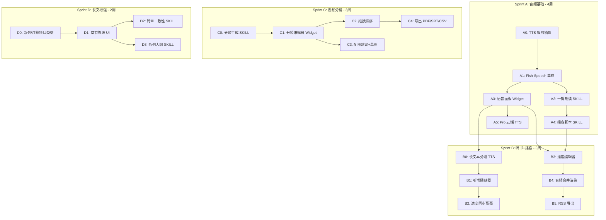

# WriteNow 创作者工作台发展路线（详细版）

## 一、战略定位与架构全景

### 1.1 产品定位升级

从"AI 驱动的文字创作 IDE"升级为**"创作者的全链路工作台"**：

```
┌─────────────────────────────────────────────────────────────────────────────┐
│                        WriteNow 创作者工作台                                  │
├─────────────────────────────────────────────────────────────────────────────┤
│                                                                             │
│   ┌─────────────┐      ┌─────────────┐      ┌─────────────┐                │
│   │   文字创作   │ ───→ │   音频制作   │ ───→ │   视频策划   │                │
│   │             │      │             │      │             │                │
│   │ • 长文/系列  │      │ • 语音朗读   │      │ • 分镜生成   │                │
│   │ • 连载小说   │      │ • 播客制作   │      │ • 字幕导出   │                │
│   │ • AI 改写    │      │ • 听书生成   │      │ • 配图建议   │                │
│   └─────────────┘      └─────────────┘      └─────────────┘                │
│          │                    │                    │                        │
│          └────────────────────┼────────────────────┘                        │
│                               ▼                                             │
│   ┌─────────────────────────────────────────────────────────────────────┐  │
│   │                        共享基础设施层                                 │  │
│   │  ┌─────────┐ ┌─────────┐ ┌─────────┐ ┌─────────┐ ┌─────────┐       │  │
│   │  │ 项目管理 │ │ 人物卡片 │ │ 知识图谱 │ │ SKILL   │ │ 版本控制 │       │  │
│   │  └─────────┘ └─────────┘ └─────────┘ └─────────┘ └─────────┘       │  │
│   │  ┌─────────┐ ┌─────────┐ ┌─────────┐ ┌─────────┐ ┌─────────┐       │  │
│   │  │ RAG检索  │ │ 全文搜索 │ │ 用户记忆 │ │ 多格式导出│ │ 云同步   │       │  │
│   │  └─────────┘ └─────────┘ └─────────┘ └─────────┘ └─────────┘       │  │
│   └─────────────────────────────────────────────────────────────────────┘  │
└─────────────────────────────────────────────────────────────────────────────┘
```

### 1.2 技术架构扩展（基于现有 Theia + Standalone 双栈）

```
WriteNow/
├── writenow-theia/                          # Theia 版本（Production）
│   └── writenow-core/
│       ├── src/node/services/
│       │   ├── audio-service.ts             # [新增] TTS/STT 服务
│       │   ├── podcast-service.ts           # [新增] 播客编辑服务
│       │   ├── audiobook-service.ts         # [新增] 听书服务
│       │   └── storyboard-service.ts        # [新增] 分镜服务
│       └── src/browser/
│           ├── audio-panel/                 # [新增] 语音面板 Widget
│           ├── podcast-editor/              # [新增] 播客编辑器 Widget
│           ├── audiobook-player/            # [新增] 听书播放器 Widget
│           └── storyboard-editor/           # [新增] 分镜编辑器 Widget
│
├── writenow-frontend/                       # Standalone 前端
│   └── src/
│       ├── features/
│       │   ├── audio-panel/                 # [新增] 语音面板
│       │   ├── podcast-editor/              # [新增] 播客编辑器
│       │   ├── audiobook-player/            # [新增] 听书播放器
│       │   └── storyboard-editor/           # [新增] 分镜编辑器
│       ├── stores/
│       │   ├── audioStore.ts                # [新增] 音频状态
│       │   ├── podcastStore.ts              # [新增] 播客状态
│       │   └── storyboardStore.ts           # [新增] 分镜状态
│       └── lib/
│           └── audio/                       # [新增] 音频处理工具
│
├── electron/
│   └── skills/packages/pkg.writenow.builtin/1.0.0/skills/
│       ├── podcast-script/                  # [新增] 播客脚本 SKILL
│       ├── audiobook-optimize/              # [新增] 听书优化 SKILL
│       ├── storyboard-generate/             # [新增] 分镜生成 SKILL
│       ├── series-outline/                  # [新增] 系列大纲 SKILL
│       └── cross-chapter-check/             # [新增] 跨章检查 SKILL
│
└── src/types/
    └── ipc-generated.ts                     # IPC 契约（需扩展）
```

---

## 二、模块 1：语音朗读 / TTS 服务（Sprint A）

### 2.1 产品需求

**用户故事**：
- 作为公众号作者，我想把文章一键转成语音，发到喜马拉雅/小宇宙
- 作为知识博主，我想预览文章的朗读效果，调整节奏
- 作为 Pro 用户，我想用高质量音色（类似 ElevenLabs）

**用户操作路径**：
```
1. 选中文字（或全文）
2. 点击 "朗读" 按钮 / 快捷键 Cmd+Shift+R
3. 弹出语音面板：
   - 选择音色（本地/云端）
   - 调整语速（0.5x - 2.0x）
   - 预览播放
4. 导出 MP3/WAV
```

### 2.2 交互设计

**2.2.1 语音面板 UI（AudioPanel）**

```
┌─────────────────────────────────────────┐
│  🔊 语音朗读                        [×] │
├─────────────────────────────────────────┤
│                                         │
│  音色选择                               │
│  ┌─────────────────────────────────┐   │
│  │ 🎙️ 晓晓（女声·温柔）          ▼ │   │
│  └─────────────────────────────────┘   │
│                                         │
│  语速   ━━━━━━━●━━━━━━  1.2x           │
│                                         │
│  情感（Pro）                            │
│  ┌─────────────────────────────────┐   │
│  │ 😊 平静                       ▼ │   │
│  └─────────────────────────────────┘   │
│                                         │
│  ─────────────────────────────────────  │
│  📝 待朗读文本                          │
│  ┌─────────────────────────────────┐   │
│  │ 这是一段示例文字，用于预览朗读   │   │
│  │ 效果。你可以调整上方的参数...    │   │
│  └─────────────────────────────────┘   │
│                                         │
│  ⏱️ 预估时长：2 分 15 秒                │
│                                         │
│  ─────────────────────────────────────  │
│                                         │
│  ◀◀  [▶ 预览播放]  ▶▶    00:00 / 02:15 │
│                                         │
│  ┌─────────────┐  ┌─────────────────┐  │
│  │  📥 导出 MP3 │  │ 📥 导出 WAV     │  │
│  └─────────────┘  └─────────────────┘  │
└─────────────────────────────────────────┘
```

**2.2.2 快捷操作（编辑器工具栏）**

在 TipTap 浮动工具栏增加 "🔊" 按钮：
- 选中文字后显示
- 点击直接用默认音色朗读（Free 用户用本地，Pro 用云端）
- 长按弹出完整语音面板

### 2.3 技术实现

**2.3.1 IPC 契约扩展（`src/types/ipc-generated.ts`）**

```typescript
// ========== TTS 服务契约 ==========

/** 音色信息 */
export type Voice = {
  id: string;                      // 如 "fish:zh-CN-XiaoxiaoNeural"
  name: string;                    // 显示名称
  language: string;                // 语言代码
  gender: 'male' | 'female';
  provider: 'local' | 'elevenlabs' | 'azure';
  tier: 'free' | 'pro';            // 套餐限制
  sampleUrl?: string;              // 试听音频 URL
};

/** TTS 合成请求 */
export type TTSSynthesizeRequest = {
  text: string;                    // 待合成文本
  voiceId: string;                 // 音色 ID
  speed?: number;                  // 语速 (0.5-2.0, 默认 1.0)
  emotion?: string;                // 情感标签（Pro）
  format?: 'mp3' | 'wav';          // 输出格式
};

/** TTS 合成响应 */
export type TTSSynthesizeResponse = {
  audioPath: string;               // 生成的音频文件路径
  durationMs: number;              // 时长（毫秒）
  charCount: number;               // 字符数
};

/** TTS 时长估算 */
export type TTSEstimateRequest = { text: string; speed?: number; };
export type TTSEstimateResponse = { durationMs: number; charCount: number; };

// IPC 通道
// 'tts:voices:list'    → Voice[]
// 'tts:synthesize'     → TTSSynthesizeResponse
// 'tts:estimate'       → TTSEstimateResponse
// 'tts:model:status'   → { ready: boolean; downloading?: boolean; progress?: number }
// 'tts:model:download' → void (触发下载)
```

**2.3.2 后端服务（`writenow-core/src/node/services/audio-service.ts`）**

```typescript
import { injectable, inject } from 'inversify';
import { ILogger } from '@theia/core';
import { TheiaInvokeRegistry } from '../theia-invoke-adapter';

// TTS Provider 接口（策略模式）
export interface TTSProvider {
  readonly id: string;
  readonly tier: 'free' | 'pro';
  
  getVoices(): Promise<Voice[]>;
  synthesize(request: TTSSynthesizeRequest): Promise<TTSSynthesizeResponse>;
  estimateDuration(text: string, speed: number): number;
  
  // 本地模型特有
  isModelReady?(): boolean;
  downloadModel?(): Promise<void>;
  getDownloadProgress?(): number;
}

@injectable()
export class AudioService {
  private providers: Map<string, TTSProvider> = new Map();
  
  constructor(
    @inject(ILogger) private readonly logger: ILogger,
    @inject(FishSpeechProvider) fishSpeech: FishSpeechProvider,
    @inject(ElevenLabsProvider) elevenLabs: ElevenLabsProvider,
  ) {
    this.providers.set('fish', fishSpeech);
    this.providers.set('elevenlabs', elevenLabs);
  }
  
  /** 注册 IPC 处理器 */
  register(registry: TheiaInvokeRegistry): void {
    registry.handleInvoke('tts:voices:list', async () => {
      const voices: Voice[] = [];
      for (const provider of this.providers.values()) {
        voices.push(...await provider.getVoices());
      }
      return voices;
    });
    
    registry.handleInvoke('tts:synthesize', async (_evt, payload) => {
      const req = payload as TTSSynthesizeRequest;
      const providerId = this.getProviderFromVoiceId(req.voiceId);
      const provider = this.providers.get(providerId);
      if (!provider) throw createIpcError('NOT_FOUND', `Provider not found: ${providerId}`);
      return provider.synthesize(req);
    });
    
    registry.handleInvoke('tts:estimate', async (_evt, payload) => {
      const { text, speed = 1.0 } = payload as TTSEstimateRequest;
      // 中文约 4 字/秒，英文约 150 词/分钟
      const charCount = text.length;
      const baseRate = 4; // 字/秒
      const durationMs = Math.round((charCount / baseRate / speed) * 1000);
      return { durationMs, charCount };
    });
    
    // 本地模型状态
    registry.handleInvoke('tts:model:status', async () => {
      const fish = this.providers.get('fish') as FishSpeechProvider;
      return {
        ready: fish.isModelReady(),
        downloading: fish.isDownloading(),
        progress: fish.getDownloadProgress(),
      };
    });
    
    registry.handleInvoke('tts:model:download', async () => {
      const fish = this.providers.get('fish') as FishSpeechProvider;
      await fish.downloadModel();
    });
  }
  
  private getProviderFromVoiceId(voiceId: string): string {
    // voiceId 格式: "provider:voiceName"
    return voiceId.split(':')[0];
  }
}
```

**2.3.3 Fish-Speech 本地 Provider（`fish-speech-provider.ts`）**

```typescript
import { injectable, inject } from 'inversify';
import * as path from 'path';
import * as fs from 'fs/promises';
import { spawn } from 'child_process';

@injectable()
export class FishSpeechProvider implements TTSProvider {
  readonly id = 'fish';
  readonly tier = 'free' as const;
  
  private modelDir: string;
  private modelReady = false;
  private downloading = false;
  private downloadProgress = 0;
  
  constructor(@inject('DataDir') dataDir: string) {
    this.modelDir = path.join(dataDir, 'models', 'fish-speech');
  }
  
  async getVoices(): Promise<Voice[]> {
    // Fish-Speech 内置音色
    return [
      { id: 'fish:zh-female-1', name: '晓晓（女声·温柔）', language: 'zh-CN', gender: 'female', provider: 'local', tier: 'free' },
      { id: 'fish:zh-male-1', name: '云扬（男声·沉稳）', language: 'zh-CN', gender: 'male', provider: 'local', tier: 'free' },
      { id: 'fish:en-female-1', name: 'Emma (Female)', language: 'en-US', gender: 'female', provider: 'local', tier: 'free' },
      { id: 'fish:en-male-1', name: 'James (Male)', language: 'en-US', gender: 'male', provider: 'local', tier: 'free' },
    ];
  }
  
  async synthesize(request: TTSSynthesizeRequest): Promise<TTSSynthesizeResponse> {
    if (!this.modelReady) {
      throw createIpcError('MODEL_NOT_READY', 'TTS model not downloaded');
    }
    
    const outputPath = path.join(this.modelDir, 'output', `${Date.now()}.${request.format || 'mp3'}`);
    await fs.mkdir(path.dirname(outputPath), { recursive: true });
    
    // 调用 Fish-Speech CLI 或 Python API
    await this.runFishSpeech(request.text, request.voiceId, outputPath, request.speed);
    
    const durationMs = this.estimateDuration(request.text, request.speed || 1.0);
    return { audioPath: outputPath, durationMs, charCount: request.text.length };
  }
  
  private async runFishSpeech(text: string, voiceId: string, outputPath: string, speed: number): Promise<void> {
    // 使用 fish-speech CLI 或 HTTP API
    // 实际实现需根据 Fish-Speech 的具体接口调整
    return new Promise((resolve, reject) => {
      const proc = spawn('python', [
        '-m', 'fish_speech.tools.api_server',
        '--text', text,
        '--voice', voiceId.split(':')[1],
        '--output', outputPath,
        '--speed', String(speed),
      ], { cwd: this.modelDir });
      
      proc.on('close', (code) => {
        if (code === 0) resolve();
        else reject(new Error(`Fish-Speech exited with code ${code}`));
      });
    });
  }
  
  estimateDuration(text: string, speed: number): number {
    const charCount = text.length;
    const baseRate = 4; // 中文约 4 字/秒
    return Math.round((charCount / baseRate / speed) * 1000);
  }
  
  isModelReady(): boolean { return this.modelReady; }
  isDownloading(): boolean { return this.downloading; }
  getDownloadProgress(): number { return this.downloadProgress; }
  
  async downloadModel(): Promise<void> {
    if (this.downloading) return;
    this.downloading = true;
    this.downloadProgress = 0;
    
    try {
      // 下载 Fish-Speech 模型（约 1.2GB）
      // 使用 huggingface_hub 或直接 HTTP 下载
      // 进度通过事件发送到前端
      await this.downloadFromHuggingFace('fishaudio/fish-speech-1.5', this.modelDir, (progress) => {
        this.downloadProgress = progress;
      });
      this.modelReady = true;
    } finally {
      this.downloading = false;
    }
  }
}
```

**2.3.4 前端组件（`writenow-frontend/src/features/audio-panel/AudioPanel.tsx`）**

```tsx
import { useState, useEffect } from 'react';
import { useAudioStore } from '@/stores/audioStore';
import { invoke } from '@/lib/rpc';
import { Select, Slider, Button } from '@/components/ui';

export function AudioPanel() {
  const { 
    selectedText, 
    voices, 
    selectedVoice, 
    speed, 
    isPlaying,
    audioUrl,
    setVoice, 
    setSpeed,
    setAudioUrl,
  } = useAudioStore();
  
  const [estimatedDuration, setEstimatedDuration] = useState(0);
  const [synthesizing, setSynthesizing] = useState(false);
  
  // 加载音色列表
  useEffect(() => {
    invoke('tts:voices:list', {}).then((voices) => {
      useAudioStore.getState().setVoices(voices);
    });
  }, []);
  
  // 估算时长
  useEffect(() => {
    if (selectedText) {
      invoke('tts:estimate', { text: selectedText, speed }).then((res) => {
        setEstimatedDuration(res.durationMs);
      });
    }
  }, [selectedText, speed]);
  
  const handleSynthesize = async () => {
    if (!selectedText || !selectedVoice) return;
    
    setSynthesizing(true);
    try {
      const result = await invoke('tts:synthesize', {
        text: selectedText,
        voiceId: selectedVoice.id,
        speed,
        format: 'mp3',
      });
      setAudioUrl(`file://${result.audioPath}`);
    } finally {
      setSynthesizing(false);
    }
  };
  
  const handleExport = async (format: 'mp3' | 'wav') => {
    // 调用导出服务
    const result = await invoke('tts:synthesize', {
      text: selectedText,
      voiceId: selectedVoice.id,
      speed,
      format,
    });
    // 打开保存对话框或直接下载
    window.electronAPI?.showItemInFolder(result.audioPath);
  };
  
  return (
    <div className="audio-panel p-4 space-y-4">
      <h3 className="text-lg font-semibold">🔊 语音朗读</h3>
      
      {/* 音色选择 */}
      <div>
        <label className="text-sm text-muted-foreground">音色选择</label>
        <Select
          value={selectedVoice?.id}
          onValueChange={(id) => setVoice(voices.find(v => v.id === id))}
          options={voices.map(v => ({
            value: v.id,
            label: `${v.name} (${v.tier === 'pro' ? 'Pro' : '免费'})`,
          }))}
        />
      </div>
      
      {/* 语速调节 */}
      <div>
        <label className="text-sm text-muted-foreground">语速: {speed.toFixed(1)}x</label>
        <Slider
          min={0.5}
          max={2.0}
          step={0.1}
          value={[speed]}
          onValueChange={([v]) => setSpeed(v)}
        />
      </div>
      
      {/* 待朗读文本预览 */}
      <div>
        <label className="text-sm text-muted-foreground">待朗读文本</label>
        <div className="border rounded p-2 max-h-32 overflow-y-auto text-sm">
          {selectedText || '请在编辑器中选中文字'}
        </div>
      </div>
      
      {/* 预估时长 */}
      <div className="text-sm text-muted-foreground">
        ⏱️ 预估时长：{formatDuration(estimatedDuration)}
      </div>
      
      {/* 播放控制 */}
      {audioUrl && (
        <audio controls src={audioUrl} className="w-full" />
      )}
      
      {/* 操作按钮 */}
      <div className="flex gap-2">
        <Button 
          onClick={handleSynthesize} 
          disabled={!selectedText || synthesizing}
        >
          {synthesizing ? '生成中...' : '▶ 预览播放'}
        </Button>
        <Button variant="outline" onClick={() => handleExport('mp3')}>
          📥 导出 MP3
        </Button>
        <Button variant="outline" onClick={() => handleExport('wav')}>
          📥 导出 WAV
        </Button>
      </div>
    </div>
  );
}

function formatDuration(ms: number): string {
  const seconds = Math.floor(ms / 1000);
  const minutes = Math.floor(seconds / 60);
  const secs = seconds % 60;
  return `${minutes} 分 ${secs.toString().padStart(2, '0')} 秒`;
}
```

**2.3.5 状态管理（`writenow-frontend/src/stores/audioStore.ts`）**

```typescript
import { create } from 'zustand';

interface AudioState {
  // 文本
  selectedText: string;
  setSelectedText: (text: string) => void;
  
  // 音色
  voices: Voice[];
  selectedVoice: Voice | null;
  setVoices: (voices: Voice[]) => void;
  setVoice: (voice: Voice | undefined) => void;
  
  // 参数
  speed: number;
  setSpeed: (speed: number) => void;
  
  // 播放状态
  isPlaying: boolean;
  audioUrl: string | null;
  setAudioUrl: (url: string | null) => void;
  
  // 模型状态
  modelReady: boolean;
  modelDownloading: boolean;
  modelProgress: number;
}

export const useAudioStore = create<AudioState>((set) => ({
  selectedText: '',
  setSelectedText: (text) => set({ selectedText: text }),
  
  voices: [],
  selectedVoice: null,
  setVoices: (voices) => set({ voices, selectedVoice: voices[0] || null }),
  setVoice: (voice) => set({ selectedVoice: voice || null }),
  
  speed: 1.0,
  setSpeed: (speed) => set({ speed }),
  
  isPlaying: false,
  audioUrl: null,
  setAudioUrl: (url) => set({ audioUrl: url }),
  
  modelReady: false,
  modelDownloading: false,
  modelProgress: 0,
}));
```

### 2.4 SKILL：播客脚本转换

**文件位置**：`electron/skills/packages/pkg.writenow.builtin/1.0.0/skills/podcast-script/SKILL.md`

```yaml
---
id: builtin:podcast-script
name: 转播客脚本
description: 将书面文章转换为适合口播的播客脚本，添加停顿标记和口语化表达
version: 1.0.0
tags: [audio, transform]
kind: single
scope: builtin
packageId: pkg.writenow.builtin
modelProfile:
  tier: standard
  preferred: claude-3-5-sonnet-latest
output:
  format: plain_text
prompt:
  system: |
    你是 WriteNow 的播客脚本转换助手。你的任务是将书面文章转换为适合朗读的播客脚本。

    转换规则：
    1. 将书面语转换为口语化表达
    2. 添加停顿标记：
       - [pause] = 短停顿（0.5秒）
       - [long_pause] = 长停顿（1.5秒）
       - [breath] = 换气停顿
    3. 处理特殊内容：
       - 数字：转为口语形式（如 "100万" → "一百万"）
       - 缩写：展开（如 "AI" → "A I" 或 "人工智能"）
       - 标点：适当转换（如 "——" → [pause]）
    4. 添加语气词和过渡词，增强听感
    5. 保持原文核心信息不变

    输出格式：
    - 纯文本，包含停顿标记
    - 不要添加任何解释说明
  user: |
    请将以下文章转换为播客脚本：

    {{text}}
context_rules:
  surrounding: 0
  user_preferences: true
  style_guide: false
---
## Intent
将书面文章转换为适合语音朗读的播客脚本，添加停顿标记和口语化表达，提升听感。
```

---

## 三、模块 2：听书功能（Sprint B）

### 3.1 产品需求

**用户故事**：
- 作为长篇小说作者，我想把整本书转成有声书，测试阅读体验
- 作为读者，我想听书时能看到当前朗读位置
- 作为作者，我想按章节管理音频，方便后续编辑

**与播客的区别**：
| 维度 | 播客 | 听书 |
|------|------|------|
| 时长 | 10-30 分钟/集 | 可达数小时 |
| 内容 | 口语化脚本 | 保留书面语 |
| 结构 | 单集独立 | 章节导航 |
| 交互 | 播放/导出 | 书签/倍速/进度同步 |

### 3.2 交互设计

**3.2.1 听书播放器 UI（AudiobookPlayer）**

```
┌─────────────────────────────────────────────────────────────────┐
│  📖 听书模式 - 《我的小说》                              [×] │
├─────────────────────────────────────────────────────────────────┤
│                                                                 │
│  ┌───────────────────────────────────────────────────────────┐ │
│  │                                                           │ │
│  │    第三章：相遇                                           │ │
│  │                                                           │ │
│  │    那是一个阳光明媚的下午，张三走在熙熙攘攘的街道上。     │ │
│  │    他的目光被一家古旧的书店吸引，店门口挂着褪色的招牌。   │ │
│  │    ▶【推开那扇吱呀作响的木门，一股淡淡的墨香扑面而来。】◀ │ │
│  │    书架上摆满了泛黄的旧书，阳光透过窗户洒在地板上...     │ │
│  │                                                           │ │
│  └───────────────────────────────────────────────────────────┘ │
│                                                                 │
│  ─────────●───────────────────────────────────  05:32 / 45:20  │
│                                                                 │
│       ◀◀     [▶ 播放]     ▶▶        🔊 ━━●━━━   1.2x          │
│                                                                 │
│  ─────────────────────────────────────────────────────────────  │
│  📑 章节列表                                                    │
│  ┌───────────────────────────────────────────────────────────┐ │
│  │  ○ 第一章：序幕                               [12:30]     │ │
│  │  ○ 第二章：启程                               [18:45]     │ │
│  │  ● 第三章：相遇（播放中）                      [45:20]     │ │
│  │  ○ 第四章：转折                               [待生成]     │ │
│  │  ○ 第五章：高潮                               [待生成]     │ │
│  └───────────────────────────────────────────────────────────┘ │
│                                                                 │
│  🔖 书签                                                        │
│  ┌───────────────────────────────────────────────────────────┐ │
│  │  • 第三章 05:32 "推开那扇吱呀作响的木门"      [跳转] [删除]│ │
│  │  • 第一章 08:15 "他终于做出了决定"            [跳转] [删除]│ │
│  └───────────────────────────────────────────────────────────┘ │
│                                                                 │
│  [📥 导出全书音频]  [📥 导出当前章节]  [🔄 重新生成当前章节]   │
└─────────────────────────────────────────────────────────────────┘
```

**3.2.2 进度同步**

编辑器中高亮当前朗读句子：
- 当前句子：黄色背景 + 粗体
- 已读句子：淡灰色
- 未读句子：正常颜色

### 3.3 技术实现

**3.3.1 IPC 契约扩展**

```typescript
// ========== 听书服务契约 ==========

/** 章节音频信息 */
export type ChapterAudio = {
  chapterId: string;
  chapterTitle: string;
  audioPath: string | null;        // null = 未生成
  durationMs: number;
  status: 'pending' | 'generating' | 'ready' | 'error';
  generatedAt?: string;
};

/** 书签 */
export type AudioBookmark = {
  id: string;
  chapterId: string;
  positionMs: number;
  text: string;                    // 书签位置的文本片段
  createdAt: string;
};

/** 播放状态 */
export type AudiobookPlayState = {
  projectId: string;
  currentChapterId: string;
  positionMs: number;
  isPlaying: boolean;
  speed: number;
};

// IPC 通道
// 'audiobook:chapters:list'      → ChapterAudio[]
// 'audiobook:chapter:generate'   → ChapterAudio (生成单章音频)
// 'audiobook:chapter:regenerate' → ChapterAudio
// 'audiobook:bookmark:list'      → AudioBookmark[]
// 'audiobook:bookmark:add'       → AudioBookmark
// 'audiobook:bookmark:remove'    → void
// 'audiobook:playstate:get'      → AudiobookPlayState
// 'audiobook:playstate:save'     → void
// 'audiobook:export:all'         → { zipPath: string }
// 'audiobook:export:chapter'     → { audioPath: string }
```

**3.3.2 长文本分段策略（`audiobook-service.ts`）**

```typescript
@injectable()
export class AudiobookService {
  /** 将长文本分段，每段约 500 字 */
  splitIntoSegments(text: string, maxChars = 500): string[] {
    const segments: string[] = [];
    const sentences = this.splitSentences(text);
    
    let currentSegment = '';
    for (const sentence of sentences) {
      if (currentSegment.length + sentence.length > maxChars) {
        if (currentSegment) segments.push(currentSegment.trim());
        currentSegment = sentence;
      } else {
        currentSegment += sentence;
      }
    }
    if (currentSegment) segments.push(currentSegment.trim());
    
    return segments;
  }
  
  /** 中文句子分割 */
  private splitSentences(text: string): string[] {
    // 按句号、问号、感叹号、省略号分割，保留标点
    return text.split(/(?<=[。！？…\.\!\?])/g).filter(Boolean);
  }
  
  /** 批量生成章节音频 */
  async generateChapterAudio(
    chapterId: string,
    content: string,
    voiceId: string,
    options: { speed?: number; onProgress?: (percent: number) => void }
  ): Promise<ChapterAudio> {
    const segments = this.splitIntoSegments(content);
    const audioFiles: string[] = [];
    
    for (let i = 0; i < segments.length; i++) {
      const result = await this.audioService.synthesize({
        text: segments[i],
        voiceId,
        speed: options.speed || 1.0,
        format: 'mp3',
      });
      audioFiles.push(result.audioPath);
      options.onProgress?.(((i + 1) / segments.length) * 100);
    }
    
    // 合并音频文件
    const mergedPath = await this.mergeAudioFiles(audioFiles, chapterId);
    
    return {
      chapterId,
      chapterTitle: '', // 从数据库获取
      audioPath: mergedPath,
      durationMs: await this.getAudioDuration(mergedPath),
      status: 'ready',
      generatedAt: new Date().toISOString(),
    };
  }
  
  /** 使用 ffmpeg 合并音频 */
  private async mergeAudioFiles(files: string[], outputName: string): Promise<string> {
    const outputPath = path.join(this.audioDir, `${outputName}.mp3`);
    const listFile = path.join(this.audioDir, `${outputName}.txt`);
    
    // 创建 ffmpeg concat 列表文件
    await fs.writeFile(
      listFile,
      files.map(f => `file '${f}'`).join('\n')
    );
    
    await execa('ffmpeg', [
      '-f', 'concat',
      '-safe', '0',
      '-i', listFile,
      '-c', 'copy',
      outputPath,
    ]);
    
    // 清理临时文件
    await Promise.all(files.map(f => fs.unlink(f)));
    await fs.unlink(listFile);
    
    return outputPath;
  }
}
```

**3.3.3 进度同步（编辑器高亮）**

```typescript
// writenow-frontend/src/lib/editor/audiobook-sync.ts

import { Editor } from '@tiptap/react';

export class AudiobookSyncExtension {
  private editor: Editor;
  private currentPosition = 0;
  
  constructor(editor: Editor) {
    this.editor = editor;
  }
  
  /** 根据音频时间戳高亮当前句子 */
  highlightAtPosition(positionMs: number) {
    const content = this.editor.getText();
    const sentences = this.splitSentences(content);
    
    // 根据语速估算当前句子
    const charsPerMs = 4 / 1000; // 4 字/秒
    const estimatedCharPos = Math.floor(positionMs * charsPerMs);
    
    let charCount = 0;
    let currentSentenceIndex = 0;
    for (let i = 0; i < sentences.length; i++) {
      charCount += sentences[i].length;
      if (charCount >= estimatedCharPos) {
        currentSentenceIndex = i;
        break;
      }
    }
    
    // 计算句子在编辑器中的位置
    const startPos = sentences.slice(0, currentSentenceIndex).join('').length;
    const endPos = startPos + sentences[currentSentenceIndex].length;
    
    // 设置高亮装饰
    this.editor.commands.setHighlight({
      from: startPos,
      to: endPos,
      class: 'audiobook-current-sentence',
    });
    
    // 滚动到可见区域
    this.editor.commands.scrollIntoView();
  }
}
```

---

## 四、模块 3：播客编辑器（Sprint B 继续）

### 4.1 产品需求

**用户故事**：
- 作为播客主播，我想把开场白、正文、结尾拼接成完整节目
- 作为音频编辑，我想给播客加上背景音乐
- 作为自媒体团队，我想导出标准播客 RSS feed

### 4.2 交互设计

**播客编辑器 UI（PodcastEditor）**

```
┌─────────────────────────────────────────────────────────────────────────────┐
│  🎙️ 播客编辑器 - EP01 人工智能的未来                              [×]    │
├─────────────────────────────────────────────────────────────────────────────┤
│                                                                             │
│  📋 轨道视图                                                                │
│  ┌─────────────────────────────────────────────────────────────────────┐   │
│  │  🎤 旁白轨                                                          │   │
│  │  ┌──────┐ ┌────────────────────────────┐ ┌──────────┐             │   │
│  │  │开场白 │ │        正文朗读             │ │  结尾语  │             │   │
│  │  │ 0:45 │ │         12:30              │ │   1:20   │             │   │
│  │  └──────┘ └────────────────────────────┘ └──────────┘             │   │
│  │                                                                     │   │
│  │  🎵 背景音乐轨                                                      │   │
│  │  ┌─────────────────────────────────────────────────────────────┐  │   │
│  │  │ Ambient Music (淡入淡出)                                     │  │   │
│  │  │ ▲ 20% 音量                                                   │  │   │
│  │  └─────────────────────────────────────────────────────────────┘  │   │
│  │                                                                     │   │
│  │  时间轴: 0:00 ─────────────────────────●──────────────── 14:35    │   │
│  └─────────────────────────────────────────────────────────────────────┘   │
│                                                                             │
│  📂 素材库                                                                  │
│  ┌─────────────────────────────────────────────────────────────────────┐   │
│  │  🎤 音频片段                                                        │   │
│  │  • 开场白.mp3 [0:45]                              [+ 添加到轨道]    │   │
│  │  • 正文朗读.mp3 [12:30]                           [+ 添加到轨道]    │   │
│  │  • 结尾语.mp3 [1:20]                              [+ 添加到轨道]    │   │
│  │                                                                     │   │
│  │  🎵 背景音乐                                                        │   │
│  │  • [📁 导入音乐文件]                                                │   │
│  │  • Ambient_01.mp3 [3:00]                          [+ 添加到轨道]    │   │
│  └─────────────────────────────────────────────────────────────────────┘   │
│                                                                             │
│  ─────────────────────────────────────────────────────────────────────────  │
│                                                                             │
│  ▶ 播放预览    [📥 导出 MP3]    [📥 导出 WAV]    [📡 生成 RSS Feed]        │
│                                                                             │
└─────────────────────────────────────────────────────────────────────────────┘
```

### 4.3 技术实现

**4.3.1 IPC 契约**

```typescript
// ========== 播客编辑服务契约 ==========

/** 音频片段 */
export type AudioClip = {
  id: string;
  name: string;
  path: string;
  durationMs: number;
  type: 'narration' | 'music' | 'effect';
};

/** 轨道项 */
export type TrackItem = {
  id: string;
  clipId: string;
  trackType: 'narration' | 'music';
  startMs: number;                 // 在时间轴的起始位置
  volume: number;                  // 0-100
  fadeInMs?: number;               // 淡入时长
  fadeOutMs?: number;              // 淡出时长
};

/** 播客项目 */
export type PodcastProject = {
  id: string;
  name: string;
  clips: AudioClip[];
  tracks: TrackItem[];
  totalDurationMs: number;
};

/** RSS Feed 配置 */
export type PodcastRSSConfig = {
  title: string;
  description: string;
  author: string;
  imageUrl?: string;
  language: string;
  episodes: Array<{
    title: string;
    description: string;
    audioPath: string;
    pubDate: string;
  }>;
};

// IPC 通道
// 'podcast:project:create'  → PodcastProject
// 'podcast:project:save'    → void
// 'podcast:project:load'    → PodcastProject
// 'podcast:clip:import'     → AudioClip (导入音频文件)
// 'podcast:render'          → { outputPath: string } (渲染最终音频)
// 'podcast:rss:generate'    → { rssPath: string }
```

**4.3.2 音频渲染（使用 ffmpeg）**

```typescript
@injectable()
export class PodcastService {
  async renderPodcast(project: PodcastProject, outputPath: string): Promise<void> {
    // 构建 ffmpeg 复杂滤镜命令
    const inputs: string[] = [];
    const filterComplex: string[] = [];
    
    // 添加所有音频输入
    for (const item of project.tracks) {
      const clip = project.clips.find(c => c.id === item.clipId);
      if (!clip) continue;
      
      const inputIndex = inputs.length;
      inputs.push('-i', clip.path);
      
      // 处理音量和淡入淡出
      let filter = `[${inputIndex}:a]`;
      filter += `volume=${item.volume / 100}`;
      if (item.fadeInMs) filter += `,afade=t=in:d=${item.fadeInMs / 1000}`;
      if (item.fadeOutMs) filter += `,afade=t=out:d=${item.fadeOutMs / 1000}`;
      filter += `[a${inputIndex}]`;
      filterComplex.push(filter);
    }
    
    // 混音
    const mixInputs = project.tracks.map((_, i) => `[a${i}]`).join('');
    filterComplex.push(`${mixInputs}amix=inputs=${project.tracks.length}:duration=longest[out]`);
    
    // 执行 ffmpeg
    await execa('ffmpeg', [
      ...inputs,
      '-filter_complex', filterComplex.join(';'),
      '-map', '[out]',
      '-c:a', 'libmp3lame',
      '-q:a', '2',
      outputPath,
    ]);
  }
  
  async generateRSSFeed(config: PodcastRSSConfig, outputPath: string): Promise<void> {
    const rss = `<?xml version="1.0" encoding="UTF-8"?>
<rss version="2.0" xmlns:itunes="http://www.itunes.com/dtds/podcast-1.0.dtd">
  <channel>
    <title>${escapeXml(config.title)}</title>
    <description>${escapeXml(config.description)}</description>
    <language>${config.language}</language>
    <itunes:author>${escapeXml(config.author)}</itunes:author>
    ${config.imageUrl ? `<itunes:image href="${config.imageUrl}" />` : ''}
    ${config.episodes.map(ep => `
    <item>
      <title>${escapeXml(ep.title)}</title>
      <description>${escapeXml(ep.description)}</description>
      <pubDate>${ep.pubDate}</pubDate>
      <enclosure url="${ep.audioPath}" type="audio/mpeg" />
    </item>`).join('')}
  </channel>
</rss>`;
    
    await fs.writeFile(outputPath, rss, 'utf-8');
  }
}
```

---

## 五、模块 4：视频分镜（Sprint C）

### 5.1 产品需求

**用户故事**：
- 作为短视频创作者，我想把文案转成分镜表，方便拍摄
- 作为自媒体团队，我想导出分镜表 PDF 交给摄像师
- 作为内容创作者，我想导出 SRT 字幕直接导入剪映

### 5.2 交互设计

**5.2.1 分镜编辑器 UI（StoryboardEditor）**

```
┌─────────────────────────────────────────────────────────────────────────────┐
│  🎬 分镜编辑器 - 《产品介绍视频》                   总时长: 2:45    [×]    │
├─────────────────────────────────────────────────────────────────────────────┤
│                                                                             │
│  [+ 添加分镜]  [🔄 从文案生成]  [📥 导出 PDF]  [📥 导出 SRT]  [📥 导出 CSV]│
│                                                                             │
│  ─────────────────────────────────────────────────────────────────────────  │
│                                                                             │
│  ┌─ #1 ──────────────────────────────────────────────────────────────────┐ │
│  │  ┌─────────────┐                                                      │ │
│  │  │             │  画面描述                                            │ │
│  │  │  [缩略图]   │  ┌───────────────────────────────────────────────┐  │ │
│  │  │  或生成按钮 │  │ 产品 Logo 从中心放大展开，背景渐变蓝色        │  │ │
│  │  │             │  └───────────────────────────────────────────────┘  │ │
│  │  └─────────────┘                                                      │ │
│  │                                                                        │ │
│  │  旁白/字幕                                       时长  景别  情绪     │ │
│  │  ┌───────────────────────────────────────────┐  ┌───┐ ┌──┐ ┌───┐   │ │
│  │  │ "欢迎使用 WriteNow，创作者的 AI 工作台"    │  │ 5s │ │全│ │激昂│   │ │
│  │  └───────────────────────────────────────────┘  └───┘ └──┘ └───┘   │ │
│  │                                                                        │ │
│  │  配图关键词: Logo, 放大动画, 蓝色渐变, 科技感    [🎨 生成草图]        │ │
│  │                                                     ☰ 拖拽排序        │ │
│  └────────────────────────────────────────────────────────────────────────┘ │
│                                                                             │
│  ┌─ #2 ──────────────────────────────────────────────────────────────────┐ │
│  │  ┌─────────────┐                                                      │ │
│  │  │             │  画面描述                                            │ │
│  │  │  [缩略图]   │  ┌───────────────────────────────────────────────┐  │ │
│  │  │             │  │ 用户在电脑前打字，屏幕显示 WriteNow 界面       │  │ │
│  │  └─────────────┘  └───────────────────────────────────────────────┘  │ │
│  │                                                                        │ │
│  │  旁白/字幕                                       时长  景别  情绪     │ │
│  │  ┌───────────────────────────────────────────┐  ┌───┐ ┌──┐ ┌───┐   │ │
│  │  │ "无论是写文章、做播客、还是策划视频"       │  │ 8s │ │中│ │平和│   │ │
│  │  └───────────────────────────────────────────┘  └───┘ └──┘ └───┘   │ │
│  │                                                                        │ │
│  │  配图关键词: 人物, 电脑, 办公室, 创作者         [🎨 生成草图]        │ │
│  │                                                     ☰ 拖拽排序        │ │
│  └────────────────────────────────────────────────────────────────────────┘ │
│                                                                             │
│  ... (更多分镜卡片)                                                         │
│                                                                             │
└─────────────────────────────────────────────────────────────────────────────┘
```

### 5.3 技术实现

**5.3.1 数据模型**

```typescript
// ========== 分镜服务契约 ==========

/** 单个分镜 */
export type StoryboardFrame = {
  id: string;
  order: number;                   // 排序
  
  // 内容
  sceneDescription: string;        // 画面描述
  narration: string;               // 旁白/字幕
  
  // 参数
  durationSec: number;             // 时长（秒）
  shotType: 'wide' | 'medium' | 'close' | 'extreme_close';  // 景别
  emotion: string;                 // 情绪标签
  
  // 配图
  imageKeywords: string[];         // 配图关键词
  thumbnailPath?: string;          // 缩略图路径（可选）
};

/** 分镜项目 */
export type StoryboardProject = {
  id: string;
  name: string;
  sourceArticleId?: string;        // 来源文章 ID
  frames: StoryboardFrame[];
  totalDurationSec: number;
  createdAt: string;
  updatedAt: string;
};

// IPC 通道
// 'storyboard:create'           → StoryboardProject
// 'storyboard:save'             → void
// 'storyboard:load'             → StoryboardProject
// 'storyboard:generate'         → StoryboardFrame[] (从文案生成)
// 'storyboard:frame:add'        → StoryboardFrame
// 'storyboard:frame:update'     → StoryboardFrame
// 'storyboard:frame:delete'     → void
// 'storyboard:frame:reorder'    → void
// 'storyboard:export:pdf'       → { path: string }
// 'storyboard:export:srt'       → { path: string }
// 'storyboard:export:csv'       → { path: string }
// 'storyboard:thumbnail:generate' → { path: string } (调用 DALL-E/SD)
```

**5.3.2 分镜生成 SKILL**

**文件位置**：`electron/skills/packages/pkg.writenow.builtin/1.0.0/skills/storyboard-generate/SKILL.md`

```yaml
---
id: builtin:storyboard-generate
name: 生成视频分镜
description: 将文案/脚本转换为视频分镜表，包含画面描述、时长、景别、情绪
version: 1.0.0
tags: [video, transform]
kind: single
scope: builtin
packageId: pkg.writenow.builtin
modelProfile:
  tier: high
  preferred: claude-3-5-sonnet-latest
output:
  format: json
  schema:
    type: array
    items:
      type: object
      properties:
        sceneDescription: { type: string }
        narration: { type: string }
        durationSec: { type: number }
        shotType: { type: string, enum: [wide, medium, close, extreme_close] }
        emotion: { type: string }
        imageKeywords: { type: array, items: { type: string } }
prompt:
  system: |
    你是 WriteNow 的视频分镜生成助手。你的任务是将文案/脚本转换为专业的视频分镜表。

    分镜规则：
    1. 每个分镜对应一个独立的画面/镜头
    2. 画面描述要具体，可执行（摄像师能看懂）
    3. 时长根据旁白估算（中文约 4 字/秒）
    4. 景别选择：
       - wide（全景）：建立环境、展示全貌
       - medium（中景）：人物互动、动作展示
       - close（特写）：情感表达、细节展示
       - extreme_close（大特写）：强调重点
    5. 情绪标签：平和、激昂、紧张、温馨、幽默 等
    6. 配图关键词：4-6 个词，适合作为 AI 绘图提示词

    输出格式：JSON 数组，严格按照 schema 格式
  user: |
    请将以下文案转换为视频分镜表：

    {{text}}
context_rules:
  surrounding: 0
  user_preferences: false
  style_guide: false
---
## Intent
将文案/脚本转换为专业的视频分镜表，帮助短视频创作者快速完成视频策划。
```

**5.3.3 导出功能**

```typescript
@injectable()
export class StoryboardService {
  /** 导出为 SRT 字幕 */
  async exportToSRT(project: StoryboardProject, outputPath: string): Promise<void> {
    let srt = '';
    let currentTimeMs = 0;
    
    for (let i = 0; i < project.frames.length; i++) {
      const frame = project.frames[i];
      const startTime = this.formatSRTTime(currentTimeMs);
      const endTime = this.formatSRTTime(currentTimeMs + frame.durationSec * 1000);
      
      srt += `${i + 1}\n`;
      srt += `${startTime} --> ${endTime}\n`;
      srt += `${frame.narration}\n\n`;
      
      currentTimeMs += frame.durationSec * 1000;
    }
    
    await fs.writeFile(outputPath, srt, 'utf-8');
  }
  
  /** 导出为 PDF 分镜表 */
  async exportToPDF(project: StoryboardProject, outputPath: string): Promise<void> {
    // 使用 pdfkit 或 puppeteer 生成 PDF
    const html = this.generateStoryboardHTML(project);
    
    // 使用 puppeteer 渲染 PDF
    const browser = await puppeteer.launch();
    const page = await browser.newPage();
    await page.setContent(html);
    await page.pdf({
      path: outputPath,
      format: 'A4',
      printBackground: true,
    });
    await browser.close();
  }
  
  private generateStoryboardHTML(project: StoryboardProject): string {
    return `
<!DOCTYPE html>
<html>
<head>
  <meta charset="UTF-8">
  <title>${project.name} - 分镜表</title>
  <style>
    body { font-family: 'Microsoft YaHei', sans-serif; padding: 20px; }
    .frame { border: 1px solid #ccc; margin-bottom: 20px; padding: 15px; page-break-inside: avoid; }
    .frame-header { display: flex; justify-content: space-between; margin-bottom: 10px; }
    .frame-content { display: flex; gap: 20px; }
    .thumbnail { width: 160px; height: 90px; background: #f0f0f0; }
    .details { flex: 1; }
    .meta { color: #666; font-size: 12px; margin-top: 10px; }
  </style>
</head>
<body>
  <h1>${project.name}</h1>
  <p>总时长: ${this.formatDuration(project.totalDurationSec)}</p>
  
  ${project.frames.map((frame, i) => `
  <div class="frame">
    <div class="frame-header">
      <strong>#${i + 1}</strong>
      <span>时长: ${frame.durationSec}s | 景别: ${this.translateShotType(frame.shotType)} | 情绪: ${frame.emotion}</span>
    </div>
    <div class="frame-content">
      <div class="thumbnail">
        ${frame.thumbnailPath ? `` : '[缩略图]'}
      </div>
      <div class="details">
        <p><strong>画面描述:</strong> ${frame.sceneDescription}</p>
        <p><strong>旁白/字幕:</strong> ${frame.narration}</p>
        <p class="meta">配图关键词: ${frame.imageKeywords.join(', ')}</p>
      </div>
    </div>
  </div>
  `).join('')}
</body>
</html>`;
  }
  
  private translateShotType(type: string): string {
    const map: Record<string, string> = {
      wide: '全景',
      medium: '中景',
      close: '特写',
      extreme_close: '大特写',
    };
    return map[type] || type;
  }
  
  private formatSRTTime(ms: number): string {
    const hours = Math.floor(ms / 3600000);
    const minutes = Math.floor((ms % 3600000) / 60000);
    const seconds = Math.floor((ms % 60000) / 1000);
    const milliseconds = ms % 1000;
    return `${hours.toString().padStart(2, '0')}:${minutes.toString().padStart(2, '0')}:${seconds.toString().padStart(2, '0')},${milliseconds.toString().padStart(3, '0')}`;
  }
}
```

---

## 六、模块 5：长文创作增强（Sprint D）

### 6.1 产品需求

**用户故事**：
- 作为连载小说作者，我想管理多个章节，保持人物/情节一致
- 作为系列文章博主，我想生成整套系列大纲
- 作为内容团队，我想检查跨章节的一致性问题

### 6.2 数据模型扩展

```sql
-- 扩展 projects 表
ALTER TABLE projects ADD COLUMN series_type TEXT DEFAULT 'single';
-- 'single' = 单篇, 'series' = 系列文章, 'novel' = 连载小说

ALTER TABLE projects ADD COLUMN chapter_count INTEGER DEFAULT 0;
ALTER TABLE projects ADD COLUMN publish_schedule TEXT;  -- JSON: 发布排期

-- 章节表（新增）
CREATE TABLE chapters (
  id TEXT PRIMARY KEY,
  project_id TEXT NOT NULL,
  article_id TEXT NOT NULL,       -- 关联 articles 表
  chapter_number INTEGER NOT NULL,
  title TEXT NOT NULL,
  status TEXT DEFAULT 'draft',    -- draft, published, scheduled
  scheduled_at TEXT,              -- 排期发布时间
  word_count INTEGER DEFAULT 0,
  created_at TEXT NOT NULL,
  updated_at TEXT NOT NULL,
  FOREIGN KEY (project_id) REFERENCES projects(id),
  FOREIGN KEY (article_id) REFERENCES articles(id)
);

-- 跨章一致性检查结果（新增）
CREATE TABLE consistency_checks (
  id TEXT PRIMARY KEY,
  project_id TEXT NOT NULL,
  check_type TEXT NOT NULL,       -- 'character', 'timeline', 'plot'
  status TEXT DEFAULT 'pending',  -- pending, passed, warning, error
  issues TEXT,                    -- JSON: 发现的问题列表
  checked_at TEXT,
  FOREIGN KEY (project_id) REFERENCES projects(id)
);
```

### 6.3 跨章一致性检查 SKILL

**文件位置**：`electron/skills/packages/pkg.writenow.builtin/1.0.0/skills/cross-chapter-check/SKILL.md`

```yaml
---
id: builtin:cross-chapter-check
name: 跨章一致性检查
description: 检查连载小说/系列文章中的人物、时间线、情节一致性问题
version: 1.0.0
tags: [analysis, longform]
kind: single
scope: builtin
packageId: pkg.writenow.builtin
modelProfile:
  tier: high
  preferred: claude-3-5-sonnet-latest
output:
  format: json
  schema:
    type: object
    properties:
      overallStatus: { type: string, enum: [passed, warning, error] }
      issues:
        type: array
        items:
          type: object
          properties:
            type: { type: string }
            severity: { type: string, enum: [info, warning, error] }
            description: { type: string }
            location: { type: string }
            suggestion: { type: string }
prompt:
  system: |
    你是 WriteNow 的一致性检查助手。你的任务是检查长篇作品中的一致性问题。

    检查维度：
    1. 人物一致性
       - 姓名/称呼是否统一
       - 性格/特征是否前后矛盾
       - 人物关系是否混乱
    
    2. 时间线一致性
       - 事件顺序是否合理
       - 时间跳跃是否有标记
       - 季节/日期描写是否矛盾
    
    3. 情节一致性
       - 伏笔是否回收
       - 物品/道具是否前后呼应
       - 场景描写是否一致

    输出格式：JSON，包含 overallStatus 和 issues 数组
  user: |
    请检查以下章节内容的一致性：

    ## 人物设定
    {{characters}}

    ## 章节内容
    {{chapters}}
context_rules:
  characters: true
  knowledge_graph: true
  surrounding: 0
---
## Intent
帮助长篇作品作者检查跨章节的一致性问题，避免人物混乱、时间线错误、情节矛盾等问题。
```

---

## 七、实施路线图（细化）

### 7.1 依赖关系图



### 7.2 里程碑

| 里程碑 | 目标 | 预计完成 | 验收标准 |
|--------|------|----------|----------|
| M1 | 语音朗读 MVP | Sprint A 第 2 周 | 用户可选中文字，用本地 TTS 朗读并导出 MP3 |
| M2 | 音频完整闭环 | Sprint B 第 2 周 | 用户可完成 "写文章 → 转播客 → 导出 RSS" 全流程 |
| M3 | 视频分镜 MVP | Sprint C 第 2 周 | 用户可从文案生成分镜表并导出 SRT 字幕 |
| M4 | 长文创作增强 | Sprint D 第 2 周 | 用户可管理系列章节并检查一致性 |
| M5 | Pro 功能上线 | Sprint B/C 后 | ElevenLabs 音色、分镜草图生成功能上线 |

### 7.3 任务卡片示例

**Task A1: Fish-Speech 本地 TTS 集成**

```yaml
Task: A1-fish-speech-integration
Sprint: Sprint A
Issue: TBD
Status: pending

## 目标
集成 Fish-Speech (OpenAudio) 作为本地 TTS 引擎，支持中英日三语语音合成。

## 必读前置
- Fish-Speech 官方文档: https://speech.fish.audio/
- 现有本地 LLM 下载模式: `writenow-theia/writenow-core/src/node/services/model-service.ts`

## 技术方案
1. 模型下载：使用 huggingface_hub 下载 fishaudio/fish-speech-1.5 (~1.2GB)
2. 推理方式：启动 Fish-Speech HTTP API 服务 (localhost:8080)
3. 接口封装：实现 TTSProvider 接口

## 验收标准
- [ ] 首次使用时提示下载模型，显示进度
- [ ] 模型下载完成后，可合成中文语音
- [ ] 合成速度：1000 字 < 30 秒（CPU）
- [ ] 输出格式：MP3/WAV
- [ ] 单元测试覆盖核心功能

## 文件变更
- `writenow-theia/writenow-core/src/node/services/audio-service.ts` (新增)
- `writenow-theia/writenow-core/src/node/services/fish-speech-provider.ts` (新增)
- `writenow-theia/writenow-core/src/common/writenow-protocol.ts` (扩展 TTS 协议)
- `src/types/ipc-generated.ts` (扩展 IPC 类型)

## 依赖
- A0: TTS 服务抽象

## 预估工时
3 天
```

---

## 八、商业模式扩展

### 8.1 功能权限矩阵（完整版）

| 功能 | Free | Pro (¥99/月) | Team (¥199/人/月) |
|------|------|--------------|-------------------|
| **文字创作** |
| TipTap 编辑器 | ✓ | ✓ | ✓ |
| AI SKILL（基础） | 3 个 | 全部 | 全部 |
| 自定义 SKILL | ✗ | ✓ | ✓ |
| 版本历史 | 7 天 | 无限 | 无限 |
| **语音功能** |
| 一键朗读（本地） | ✓ 5000 字/月 | ✓ 无限 | ✓ 无限 |
| 高质量语音（云端） | ✗ | ✓ 10 万字/月 | ✓ 无限 |
| 语音导出 MP3/WAV | ✓ | ✓ | ✓ |
| **播客功能** |
| 播客脚本转换 | ✓ 3 次/月 | ✓ 无限 | ✓ 无限 |
| 播客编辑器 | ✗ | ✓ | ✓ |
| RSS Feed 生成 | ✗ | ✓ | ✓ |
| **听书功能** |
| 单章听书 | ✓ | ✓ | ✓ |
| 全书批量生成 | ✗ | ✓ | ✓ |
| 书签/进度同步 | ✗ | ✓ | ✓ |
| **视频分镜** |
| 分镜生成 | ✓ 3 次/月 | ✓ 无限 | ✓ 无限 |
| 分镜编辑器 | ✓ | ✓ | ✓ |
| 导出 SRT/CSV | ✓ | ✓ | ✓ |
| 导出 PDF | ✗ | ✓ | ✓ |
| AI 生成草图 | ✗ | ✓ | ✓ |
| **长文增强** |
| 系列/连载项目 | ✗ | ✓ | ✓ |
| 跨章一致性检查 | ✗ | ✓ | ✓ |
| 系列大纲生成 | ✗ | ✓ | ✓ |

### 8.2 成功指标（KPI）

| 指标 | 当前基线 | 目标 | 测量方式 |
|------|----------|------|----------|
| 语音功能使用率 | 0% | 30% 用户尝试过 | 事件埋点 |
| 播客导出量 | 0 | 月活用户 10% 导出过 | 导出事件 |
| 分镜功能渗透 | 0% | 自媒体团队用户占比提升 20% | 用户标签 |
| 7 日留存 | TBD | 提升 5 个百分点 | 用户分析 |
| Pro 转化率 | TBD | 提升 3 个百分点 | 订阅数据 |

---

## 九、风险与缓解策略

| 风险 | 影响 | 概率 | 缓解措施 |
|------|------|------|----------|
| Fish-Speech 中文效果不佳 | 高 | 中 | 先做 PoC 验证；备选方案：XTTS-v2、CosyVoice |
| 本地 TTS 模型体积大 (~1.2GB) | 中 | 高 | 按需下载；清晰的下载进度 UI；支持取消 |
| ffmpeg 依赖问题 | 中 | 低 | 使用 ffmpeg-static NPM 包；提供安装引导 |
| 分镜编辑器交互复杂 | 中 | 中 | 分阶段：先列表 → 再拖拽 → 再时间轴 |
| 音频处理性能（长文） | 中 | 中 | 分段处理；后台任务；进度反馈 |
| Pro 功能云端依赖稳定性 | 低 | 低 | 降级策略：云端失败时回退本地 |

---

## 十、附录

### 10.1 技术选型对比

**TTS 引擎对比**

| 方案 | 质量 | 体积 | 授权 | 中文支持 | 推荐 |
|------|------|------|------|----------|------|
| Fish-Speech 1.5 | ⭐⭐⭐⭐⭐ | 1.2GB | Apache | ⭐⭐⭐⭐⭐ | ✅ 首选 |
| XTTS-v2 | ⭐⭐⭐⭐ | 1.8GB | CPML (非商用) | ⭐⭐⭐⭐ | 备选 |
| CosyVoice | ⭐⭐⭐⭐ | 1.5GB | Apache | ⭐⭐⭐⭐⭐ | 备选 |
| Piper | ⭐⭐⭐ | 50MB | MIT | ⭐⭐ | 轻量场景 |
| ElevenLabs (云) | ⭐⭐⭐⭐⭐ | - | 商用付费 | ⭐⭐⭐⭐ | Pro 版 |
| Azure TTS (云) | ⭐⭐⭐⭐⭐ | - | 商用付费 | ⭐⭐⭐⭐⭐ | Pro 版 |

### 10.2 参考资料

- Fish-Speech: https://speech.fish.audio/
- ElevenLabs API: https://elevenlabs.io/docs
- ffmpeg concat: https://trac.ffmpeg.org/wiki/Concatenate
- SRT 字幕格式: https://en.wikipedia.org/wiki/SubRip
- Podcast RSS 规范: https://podcasters.apple.com/support/823-podcast-requirements

