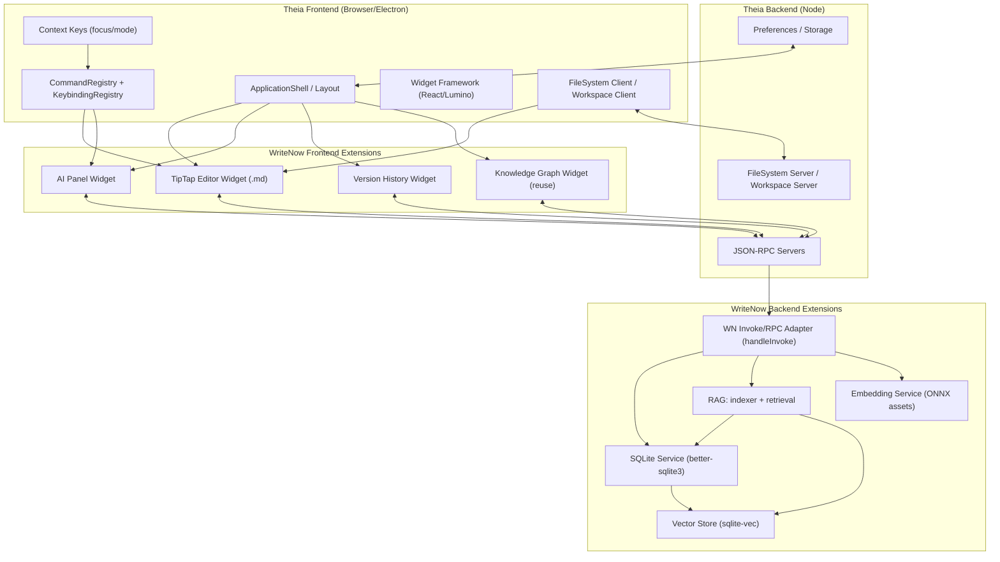

# Architecture: Theia + WriteNow（目标形态）

> Why: WriteNow 迁移的核心不是“换 UI 框架”，而是获得一个可裁剪、可扩展、可测试的 IDE 基座；因此必须把 Theia 核心模块与 WriteNow 扩展边界画清楚，避免迁移期耦合失控。

## Goals

- 定义清晰的模块边界：Theia frontend（UI + editor widgets）/ Theia backend（本地服务）/ 本地持久化（userData/workspace）。
- 迁移期保持 **契约与错误语义稳定**：`IpcResponse<T>`（`ok: true|false` + 错误码）不变，仅替换 transport 为 Theia JSON-RPC。
- 保持 local-first，同时允许对齐 Theia-native 工作流（workspace、commands、keybindings）。

## Overview

- **Theia Core** 提供：应用壳体（frontend/backend）、Workbench/Shell（布局容器）、命令/快捷键体系、Workspace/FileSystem、偏好设置与存储等。
- **WriteNow Extension(s)** 提供：TipTap 编辑器（Markdown SSOT）、AI 面板、版本历史、知识图谱面板、以及后端的数据/索引/Embedding/RAG 服务。
- **Transport**：frontend ↔ backend 通过 Theia JSON-RPC（request/response + notifications/stream）通信，承载原 Electron IPC 的契约。

## Module Dependency（Mermaid）

## Responsibilities

- **Frontend**：负责 editor focus、context keys、keybinding 路由与 UI 组合；所有数据写入必须通过 RPC 进入 backend（避免隐式全局与双写）。
- **Backend**：承载 project/document services、AI/RAG/Embedding、以及存储网关；在 RPC 边界执行统一错误包装（`IpcResponse`）。
- **Local Data**：明确哪些数据属于 user-scoped（设置/模型/缓存/共享索引），哪些属于 workspace/project-scoped（文稿/项目元数据）；详见 `storage-model.md`。

## Key Decisions / Boundaries

### 1) Contract as SSOT

迁移期最重要的稳定面是 **RPC/IPC 合约**（channel + types + drift guard），而不是 UI 细节。

### 2) Markdown as SSOT

TipTap 是视图层，Markdown 是内容单一事实源（SSOT）；禁止引入第二份富文本持久化源。

### 3) Storage Model is the Root Decision

Theia 默认 workspace-first；WriteNow 历史 userData-first。存储语义决定将直接影响：File Explorer、索引器/监听器、迁移策略、以及 E2E 的隔离策略。

### 4) Focus model (Context Keys)

TipTap editor 的焦点状态必须显式写入 Theia 的 context keys（例如 `writenow.editorFocus`），以确保快捷键路由可预测且可调试；详见 `tiptap-integration.md`。

## Risks

- **native 分发**：`better-sqlite3` / `sqlite-vec` /（潜在）`node-llama-cpp` 的跨平台打包与加载风险可能主导排期。
- **快捷键与焦点路由**：Theia 全局 keybinding 与 ProseMirror keymap 冲突必须有“可解释”的统一策略，否则会出现高频输入 bug。

