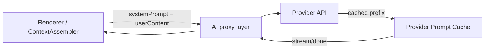

# 01 - Prompt Caching 设计（OpenAI / Anthropic）

本设计文档定义如何在 WriteNow 中启用 **Provider 原生 Prompt Caching**，以降低重复上下文的 token 成本与延迟。

> 原则：缓存收益来自“前缀完全一致”。因此我们优先约束 **prompt 结构与稳定性**，而不是自建缓存系统。

---

## 背景与现状（Repo 事实）

- Anthropic SDK（主进程 IPC 代理）：`electron/ipc/ai.cjs` 使用 `@anthropic-ai/sdk` 发起 `messages.stream` / `messages.create`。
- AI Provider 配置类型已包含 `openai`：`src/types/ai.ts`，但 `electron/ipc/ai.cjs` 当前仅允许 `anthropic`。

约束：
- prompt 的 SSOT 在调用方（renderer / ContextAssembler）。主进程/后端 **不得** trim/normalize prompt 字节（避免破坏缓存命中与可审计性）。
  - 现有实现已体现该约束：`electron/ipc/ai.cjs` 的 `requirePromptString()` 注释说明“不改变 prompt bytes”。

---

## 设计目标

- Anthropic：对稳定 system 前缀显式开启 `cache_control`（ephemeral）。
- OpenAI：维持稳定前缀结构，利用“自动 prompt caching”，并提供命中观测（当 OpenAI provider 接入后）。
- 缓存不可用时自动回退，并提供可观测指标（不记录 prompt 明文）。

---

## 架构与缓存点



缓存命中前提：
- `systemPrompt` 前缀稳定
- tools/格式定义稳定
- 动态上下文（选区/文件内容/检索结果）只追加在末尾

---

## Anthropic Prompt Caching（建议作为 P0 实施路径）

### 关键策略

1. 将 `system` 从字符串升级为 **system blocks** 数组。
2. 仅对“稳定、可复用”的 system block 设置：`cache_control: { type: 'ephemeral' }`。
3. 不把用户敏感内容放入可缓存块（动态内容保持在 user message）。

### 代码示例：`electron/ipc/ai.cjs`

> 说明：示例展示结构调整的最小改动；实际落地需保持现有错误映射与 cancel/timeout 语义。

```js
// Before: system: <string>
// After: system: [{ type: 'text', text: <string>, cache_control: { type: 'ephemeral' } }]
const systemBlocks = [
  {
    type: 'text',
    text: system,
    cache_control: { type: 'ephemeral' },
  },
]

const runner = client.messages.stream(
  {
    model,
    max_tokens: maxTokens,
    temperature,
    system: systemBlocks,
    messages: [{ role: 'user', content: user }],
  },
  { signal: controller.signal },
)
```

### 命中观测（建议）

- 读取 provider 返回的 usage 字段（如：`cache_creation_input_tokens` / `cache_read_input_tokens`）并写入日志/指标。
- 日志 MUST 禁止记录完整 prompt；仅记录：`runId/model/promptHash/prefixHash/tokensSaved`。

---

## OpenAI Prompt Caching（OpenAI provider 接入后启用）

> OpenAI 的缓存一般是自动启用；关键在于“保持前缀一致 + 提供 cache 命中观测”。

### Prompt 结构建议

- 推荐 message 顺序：
  1) `system`：全局系统规则（稳定）
  2) `system`：skill/system prompt（稳定）
  3) `user`：动态上下文（选区/检索/指令）
- 若使用 tools：tools 定义 MUST 稳定且顺序固定（属于缓存前缀的一部分）。

### 代码示例（结构）

```ts
const messages = [
  { role: 'system', content: globalSystem },
  { role: 'system', content: skillSystem },
  { role: 'user', content: dynamicUserContent },
]

await openai.responses.create({
  model,
  input: messages,
  // 可选：按 skill 粒度设置 cache key（避免过细导致命中率低；避免过粗导致单 key 高频上限）
  prompt_cache_key: `wn:skill:${skillId}`,
  prompt_cache_retention: 'in_memory',
})
```

### 命中观测（建议）

- 从返回的 usage 读取 cached tokens（例如 `usage.prompt_tokens_details.cached_tokens`）。
- 对同一 skill 的重复调用，cached_tokens SHOULD 上升（在 prompt 前缀稳定的前提下）。

---

## 回退与开关

- 必须提供配置开关以排障：
  - `ai.promptCaching.enabled = true|false`
- 缓存不可用/命中极低时：
  - MUST 回退为非缓存调用（不应影响功能可用性）
  - SHOULD 记录一次性告警（避免日志噪声）

---

## 安全与隐私

- 缓存命中观测与日志中：
  - MUST 不写入用户内容明文
  - SHOULD 使用 hash（如现有 `prefixHash`/`promptHash`）与长度指标替代
- 若未来引入 Proxy 磁盘缓存（LiteLLM）：必须额外提供“清空缓存”与可见提示（见 `design/05-litellm-proxy.md`）。
