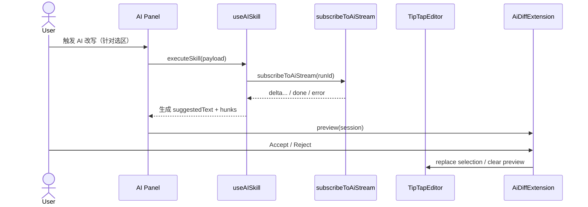

# 02 - 自研 TipTap AI Diff/Suggestion Extension

本设计文档定义 WriteNow 的 **TipTap AI Diff/Suggestion Extension**：用 ProseMirror Plugin/Decorations 在编辑器内呈现 AI 改写差异，并提供 Accept/Reject（含取消/失败语义）。

---

## 背景与现状（Repo 事实）

- TipTap 编辑器组件：`writenow-frontend/src/components/editor/TipTapEditor.tsx`
- AI 流式订阅工具：`writenow-frontend/src/lib/rpc/ai-stream.ts`
- AI 面板技能执行：`writenow-frontend/src/features/ai-panel/useAISkill.ts`
- Diff 基础工具：`writenow-frontend/src/lib/diff/diffUtils.ts`（`computeDiff` / `mergeDiff`）

约束：
- 本项目治理：见 `AGENTS.md`（单链路、显式依赖注入、失败可观测、取消/超时语义明确）。
- IPC 错误码：见 `src/types/ipc-generated.ts`（`TIMEOUT` / `CANCELED` / `UPSTREAM_ERROR` / `CONFLICT` 等）。

---

## 目标与非目标

### 目标

1. **Diff 可视化**：对 AI 建议的新增/删除/替换给出稳定、可读的视觉表达。
2. **可恢复的应用语义**：Accept/Reject 必须在文档状态发生变化时给出可判定错误并允许重试（不得 silent failure）。
3. **取消语义正确**：取消/超时/失败必须清理预览状态，不留“幽灵高亮”。
4. **不污染持久化格式**：默认通过 Decorations 实现，避免把 diff 标记写进 Markdown。

### 非目标

- 不引入第二套 diff 引擎（复用 `diffUtils.ts`）。
- 不实现完整的“逐字 track changes”编辑体验（本 Sprint 以“段落/行级 diff + 一键 accept/reject”优先）。

---

## 总体流程

### 时序（AI → Diff → Apply）



---

## 关键数据模型

> Why：Editor 侧必须能验证“应用目标是否仍然一致”，避免用户继续编辑后误覆盖。

```ts
export type AiDiffHunkType = 'add' | 'remove' | 'unchanged'

export type AiDiffHunk = {
  type: AiDiffHunkType
  content: string
}

export type AiDiffSession = {
  runId: string
  /** The exact text the diff was computed against (selection snapshot). */
  originalText: string
  /** AI output text for the same selection scope. */
  suggestedText: string
  hunks: AiDiffHunk[]
  /** Per-hunk accept mask; length MUST match hunks length. */
  accepted: boolean[]
  /** Selection coordinates captured at run start (doc positions in TipTap). */
  selection: { from: number; to: number }
  createdAt: number
}
```

---

## 扩展设计（TipTap Extension + ProseMirror Plugin）

### 1) 显式依赖注入（adapter）

> Why：遵守“拒绝隐式注入”，扩展不读取全局 store/window。

```ts
import type { IpcError } from '@/types/ipc-generated'

export type AiDiffAdapter = {
  reportError: (error: IpcError) => void
  onApplied: (payload: { runId: string; mergedText: string }) => void
}
```

### 2) 插件状态

```ts
import { PluginKey } from '@tiptap/pm/state'
import type { DecorationSet } from '@tiptap/pm/view'

export const AiDiffPluginKey = new PluginKey('wnAiDiff')

export type AiDiffPluginState = {
  session: AiDiffSession | null
  decorations: DecorationSet
}
```

### 3) Decorations 渲染策略

- `add`：对新增文本范围添加 `Decoration.inline`（绿色高亮）。
- `remove`：删除在最终文档中不存在；为保持可解释性，可选两种表示：
  1) **Inline 删除占位 widget**：在删除发生位置插入 widget（红色删除文本 + 删除线）。
  2) **Panel-only**：删除仅在侧边 diff 面板展示（编辑区只高亮新增）。

本 Sprint 默认建议：
- 编辑区使用“新增高亮 + 删除 widget（短、可读）”，避免用户在编辑区看不到“删了什么”。

### 4) Commands（核心 API）

- `aiDiffPreview(session)`：设置 session 并渲染 decorations。
- `aiDiffClear()`：清理 session 与 decorations。
- `aiDiffAcceptAll()`：计算 `mergedText`（基于 `mergeDiff`）并替换选区；清理 preview。
- `aiDiffRejectAll()`：清理 preview（不改变内容）。

伪代码示例：

```ts
import { Extension } from '@tiptap/core'
import { Plugin } from '@tiptap/pm/state'
import { Decoration, DecorationSet } from '@tiptap/pm/view'
import { computeDiff, mergeDiff } from '@/lib/diff/diffUtils'

export const AiDiffExtension = Extension.create<{ adapter: AiDiffAdapter }>( {
  name: 'aiDiff',

  addOptions() {
    return { adapter: null as unknown as AiDiffAdapter }
  },

  addProseMirrorPlugins() {
    return [
      new Plugin({
        key: AiDiffPluginKey,
        state: {
          init: () => ({ session: null, decorations: DecorationSet.empty }),
          apply: (tr, prev) => {
            const meta = tr.getMeta(AiDiffPluginKey)
            if (meta?.type === 'set') return meta.next
            if (meta?.type === 'clear') return { session: null, decorations: DecorationSet.empty }
            return { ...prev, decorations: prev.decorations.map(tr.mapping, tr.doc) }
          },
        },
        props: {
          decorations: (state) => AiDiffPluginKey.getState(state)?.decorations,
        },
      }),
    ]
  },

  addCommands() {
    return {
      aiDiffPreview:
        (session: AiDiffSession) =>
        ({ editor }) => {
          const hunks = computeDiff(session.originalText, session.suggestedText)
          const accepted = hunks.map((h) => h.type !== 'remove')

          // Minimal inline rendering: highlight additions only.
          const decorations: Decoration[] = []
          // NOTE: real implementation must map hunks->doc positions; see below.

          const next = {
            session: { ...session, hunks, accepted },
            decorations: DecorationSet.create(editor.state.doc, decorations),
          }
          editor.view.dispatch(editor.state.tr.setMeta(AiDiffPluginKey, { type: 'set', next }))
          return true
        },

      aiDiffClear:
        () =>
        ({ editor }) => {
          editor.view.dispatch(editor.state.tr.setMeta(AiDiffPluginKey, { type: 'clear' }))
          return true
        },

      aiDiffAcceptAll:
        () =>
        ({ editor }) => {
          const state = AiDiffPluginKey.getState(editor.state) as AiDiffPluginState | undefined
          if (!state?.session) return false

          const { session } = state
          const merged = mergeDiff(session.originalText, session.suggestedText, session.accepted)

          // Guard: selection must still be valid.
          const current = editor.state.doc.textBetween(session.selection.from, session.selection.to, '\n')
          if (current !== session.originalText) {
            this.options.adapter.reportError({
              code: 'CONFLICT',
              message: 'Selection changed; cannot apply AI diff safely',
            })
            return false
          }

          editor.commands.insertContentAt({ from: session.selection.from, to: session.selection.to }, merged)
          editor.commands.aiDiffClear()
          this.options.adapter.onApplied({ runId: session.runId, mergedText: merged })
          return true
        },

      aiDiffRejectAll:
        () =>
        ({ editor }) => {
          editor.commands.aiDiffClear()
          return true
        },
    }
  },
})
```

> 说明：真正实现需要把 hunks 映射到 ProseMirror doc positions（尤其是删除 widget）。本 Sprint 建议以“选区级整体替换”作为 Accept 的落地点，Inline 预览先覆盖新增高亮与删除 widget 的最小可用版本。

---

## TipTapEditor 集成点

在 `writenow-frontend/src/components/editor/TipTapEditor.tsx` 的 `extensions` 列表中追加：

```ts
import { AiDiffExtension } from '@/lib/editor/extensions/ai-diff'

const extensions = useMemo(() => [
  /* existing extensions */
  AiDiffExtension.configure({
    adapter: {
      reportError: (error) => onAiDiffError?.(error),
      onApplied: ({ mergedText }) => onMarkdownChanged(mergedText),
    },
  }),
], [mode, onMarkdownChanged])
```

并由 AI 面板控制器在 `done` 后调用：

```ts
editor.commands.aiDiffPreview({
  runId,
  originalText: selectionText,
  suggestedText,
  hunks: [],
  accepted: [],
  selection: { from, to },
  createdAt: Date.now(),
})
```

---

## 样式（CSS Tokens + Classes）

> Why：避免硬编码颜色；复用现有语义 token（`--success-muted` / `--danger-muted`）。

```css
.wn-tiptap-editor .wn-ai-diff-add {
  background: var(--success-muted);
  border-bottom: 1px solid var(--success);
}

.wn-tiptap-editor .wn-ai-diff-remove {
  background: var(--danger-muted);
  text-decoration: line-through;
}

.wn-tiptap-editor .wn-ai-diff-remove-widget {
  opacity: 0.85;
  border: 1px dashed var(--border-default);
  border-radius: 2px;
  padding: 0 2px;
}
```

---

## 边界条件与失败语义（必须明确）

- **Selection 变化**：Accept 时发现选区文本已变化 MUST 返回 `CONFLICT`，并保持可重试（用户可重新触发 AI）。
- **取消/超时**：收到 `CANCELED` / `TIMEOUT` 时 MUST 执行 `aiDiffClear()`。
- **不穿透异常**：任何错误必须映射为 `IpcErrorCode` 可判定分支。

---

## 可观测性

- 记录 `runId` 与 apply 行为（Applied/Rejected），用于审计与复现。
- 禁止在日志中记录用户完整文本；只记录 hash/长度等诊断信息。
