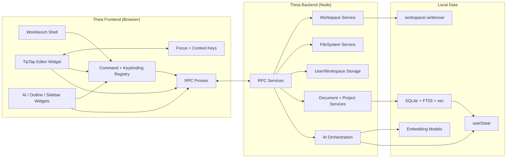

# Theia Migration Architecture

## Goals
- Define a clear module boundary between Theia frontend (UI + editor), backend services, and local storage.
- Preserve WriteNow's local-first behavior while enabling Theia-native workflows (workspaces, commands, keybindings).
- Keep IPC semantics (IpcResponse + error codes) intact while migrating transport to Theia RPC.

## Module Diagram

## Responsibilities

- **Frontend**: Owns editor focus, keybinding contexts, and UI composition. All data mutations go through RPC proxies.
- **Backend**: Hosts project/document services, AI orchestration, and storage gateways. Enforces IpcResponse semantics.
- **Local Data**: Persists user-scoped data under `userData/` and (optionally) workspace-scoped data under `.writenow/`.

## Cross-Cutting Decisions

- **RPC boundary**: All current `handleInvoke` channels map to Theia RPC services (see `ipc-migration.md`).
- **Storage policy**: Keep local-first data in `userData` by default, with workspace overlays for portability (see `storage-model.md`).
- **Focus model**: Editor focus sets Theia context keys so shortcuts route predictably (see `tiptap-integration.md`).
